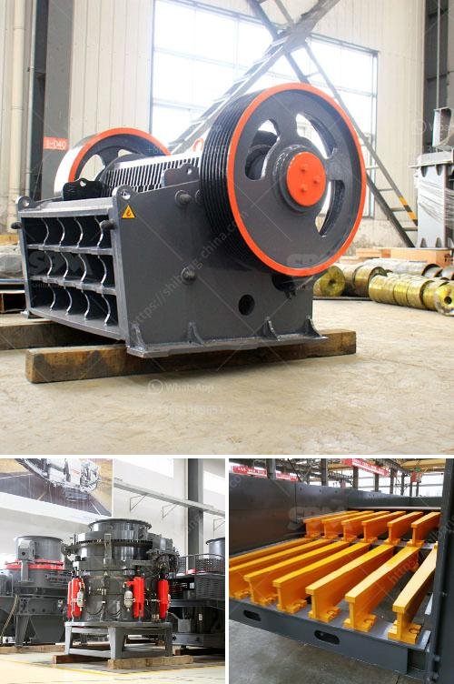

<h3>hammer mill in nigeria</h3>
The hammer mill machine is a common and essential piece of equipment in the agricultural sector in Nigeria. As well as being used in the farming industry, it is also employed in food processing, pharmaceutical, and chemical industries.

The hammer mill machine uses a motor to drive the rotor, which contains a number of hammers. The hammers spin at high speed, and the material fed into the machine is repeatedly crushed by the impact of these hammers. A typical hammer mill consists of a horizontal rotor assembly fitted inside a metal housing. The rotor assembly includes a shaft and several circular plates mounted on it with equal spaces between plates.

Hammers are fixed on the plates, which rotate along with the rotor assembly. The material is fed into the machine from the upper feeding opening and is beaten and crushed by the processing hammer. With high-speed rotation, the hammers on the rotor impact the material, causing it to be crushed into smaller pieces. When the particles are small enough, they will fall through the screen located under the rotor and exit the grinding chamber.

One of the main advantages of using the hammer mill machine is its low operating costs, especially for the agricultural sector. As the majority of farmers in Nigeria are small-scale, they lack access to modern machinery like the hammer mill. This poor access to machinery can result in high transportation costs, and this alone is a contributing factor to high production costs. The use of the hammer mill machine solves this problem.

Another advantage of the hammer mill is its ability to produce uniformly-sized material. This versatility is important, especially for small-scale farmers who require consistency and uniformity for their animal feed. By crushing the materials to a specific size, the hammer mill ensures the right feed size is supplied to the livestock for proper digestion and nutrition.

The hammer mill machine in Nigeria is also ideal for crushing farming material like dry or fresh seeding of yam, peanut, rice, and other plants, husks, maize, wheat, beans, etc.

The hammer mill can produce powder feed for poultry, livestock, and other animals in large and small quantities. It is equally suited for both small and medium-sized enterprises, as well as large-scale industrial operations.

In conclusion, the hammer mill machine is a simple, versatile, and flexible device that can be used for a wide range of agricultural purposes. It effectively crushes solid particles into fine powders, making it suitable for both small-scale and large-scale farmers. Additionally, its low operating costs make it an economically viable option for farmers in Nigeria. With its ability to deliver a uniform feed size, the hammer mill machine plays a crucial role in the nurturing and development of livestock, contributing to the growth and sustainability of the agricultural sector in the country.
<h3>Contact us</h3><ul><li><strong>Whatsapp:&nbsp;<a href="https://wa.me/8613661969651">+8613661969651</a></strong></li><li><a href="https://swt.shibang-china.com/?git&amp;zhl&amp;hammer mill in nigeria"><strong>Online Service(chat now)</strong></a></li></ul><h3>Related</h3><ul><li><a href='machine de lavage a lattrition du sable de silice.md'>machine de lavage a lattrition du sable de silice</a></li><li><a href='russia copper ore crushing plant.md'>russia copper ore crushing plant</a></li><li><a href='cost of mining conveyor belt.md'>cost of mining conveyor belt</a></li><li><a href='sand washing machines for crusher nepal.md'>sand washing machines for crusher nepal</a></li><li><a href='how to set up a granite quarry crusher.md'>how to set up a granite quarry crusher</a></li></ul>