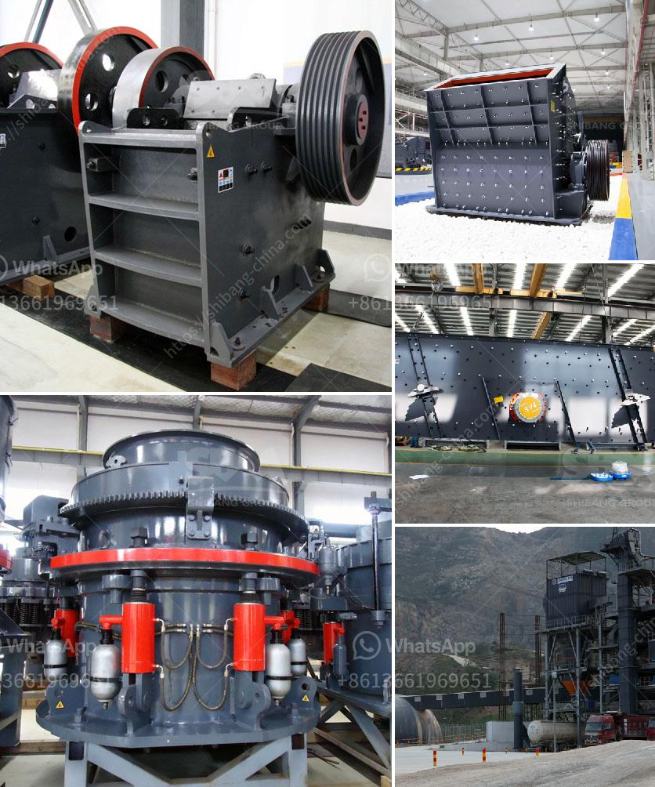

<h3>hammer mill of 1 ton per hour</h3>
The hammer mill is a machine that has been developed to crush and pulverize solid materials, such as grains, wood, and metals, into smaller pieces. This machine consists of a spinning shaft which is fitted with a series of hammers. As these hammers rotate at high speed, they impact and crush the material being fed into the mill. The resulting particles are then forced through a screen, which determines the size of the final product.

One common use of the hammer mill is in the agricultural industry. Farmers use it to grind grains and other crops into animal feed or to prepare materials for processing. For instance, corn can be ground into cornmeal, wheat into flour, and so on. This makes the hammer mill a vital piece of equipment for food production and livestock feeding.

Another industry that benefits from the hammer mill's capabilities is the recycling industry. This machine is used to break down waste materials, such as discarded wood, plastic, and metal, into smaller pieces that can be more easily handled and processed. By shredding materials like old furniture, pallets, or car parts, the hammer mill makes it possible to recycle and reuse these materials, reducing waste and minimizing the environmental impact.

One of the key advantages of the hammer mill is its flexibility. It can handle a wide range of materials and produce different sizes of particles by simply changing the screens. This versatility allows the machine to be used in various industries, making it a cost-effective investment.

For example, a 1-ton-per-hour hammer mill can handle different materials, such as cornstalks, tree branches, sawdust, and crop residues. It can crush these materials into particles ranging from coarse to fine, depending on the desired output. Additionally, the machine can be adjusted to control the speed at which the hammers rotate, further influencing the final product's size.

The size of the hammer mill can vary depending on the specific application. A 1-ton-per-hour hammer mill is suitable for small-scale operations or those with limited space. However, larger capacity mills are available for higher-volume production. These mills can handle several tons of material per hour, making them ideal for industrial-scale operations.

In terms of efficiency, the hammer mill is known for its low energy consumption. It achieves size reduction through the impact of the rotating hammers rather than relying on high-speed stirring or grinding mechanisms. This not only reduces energy costs but also minimizes wear and tear on the machine, leading to lower maintenance requirements and longer equipment life.

In conclusion, the hammer mill is a versatile and efficient machine used for size reduction in various industries. Its ability to process different materials, adjust to desired output sizes, and low energy consumption make it a valuable tool in agricultural, recycling, and manufacturing applications. Whether it is grinding grains into animal feed, recycling waste materials, or preparing raw materials for industrial processes, the hammer mill is an essential piece of equipment for improving productivity and environmental sustainability.
<h3>Contact us</h3><ul><li><strong>Whatsapp:&nbsp;<a href="https://wa.me/8613661969651">+8613661969651</a></strong></li><li><a href="https://swt.shibang-china.com/?git&amp;zhl&amp;hammer mill of 1 ton per hour"><strong>Online Service(chat now)</strong></a></li></ul><h3>Related</h3><ul><li><a href='calcium carbonate mines in pakistan.md'>calcium carbonate mines in pakistan</a></li><li><a href='the crunch hand operated rock crusher.md'>the crunch hand operated rock crusher</a></li><li><a href='cement plant in turkey.md'>cement plant in turkey</a></li><li><a href='crusher stone manufacture from china.md'>crusher stone manufacture from china</a></li><li><a href='hammer mill bison price.md'>hammer mill bison price</a></li></ul>