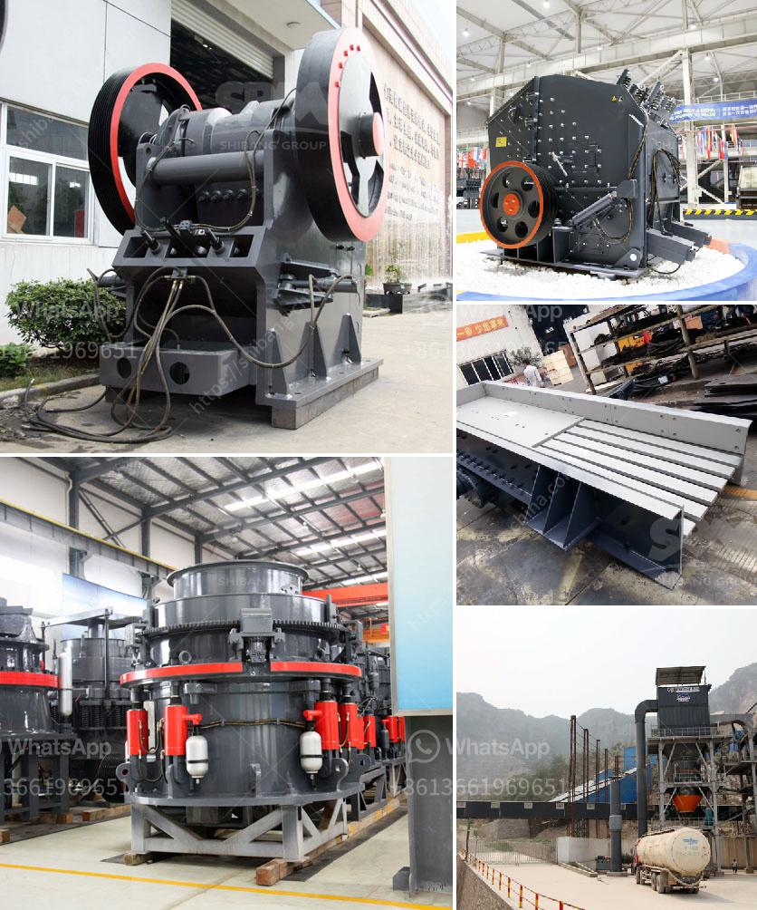

<h3>hammer mill sale south africa</h3>
Hammer mills provide an efficient and reliable method for size reduction in various industries. They are often used in the mining industry to break down ore into smaller particles for further processing. These machines are also used in the agricultural sector for grinding grain, corn, and other crops. In South Africa, hammer mills are known for their ability to provide quality and affordable solutions to a wide range of industries.

Hammer mills work on the principle of impacting the material with hammers and crushing it into smaller particles. The material is fed into the hammer mill through a gravity feed hopper and discharged through a discharge chute. The hammers are mounted on a rotating shaft and can swing freely, allowing them to strike the material with great force. This impact action breaks the material apart and reduces its size to the desired level.

South Africa is a country known for its rich agricultural heritage. With an abundance of crops such as maize, wheat, and soy, the need for efficient processing equipment is increasing. Hammer mills have become an essential piece of equipment in the agricultural industry, as they can quickly and efficiently process grains and crops into small, consistent particles. This makes them highly desirable for animal feed production, among other applications.

In the mining industry, hammer mills are used to crush and pulverize large rocks and minerals into smaller particles for further processing. These mills are often used in conjunction with other size reduction equipment such as jaw crushers, cone crushers, and ball mills. By using a combination of these machines, mining companies can achieve the desired particle size for their ore, facilitating the extraction and processing of valuable minerals.

Hammer mills have also found applications in the recycling industry. They are used to process various materials such as wood waste, paper, and plastic into smaller, manageable particles. By breaking down these materials, hammer mills allow for easier separation and recycling, reducing waste and promoting sustainability.

In South Africa, hammer mill manufacturers and sellers strive to bring machines that are reliable, experienced, and financially friendly to their customers. With an array of options available, these mills offer the perfect solution for contractors, farmers, and entrepreneurs looking to enhance their operations' efficiency and productivity.

When considering a hammer mill for sale in South Africa, it is essential to choose a machine with several key features. These include robust construction, high-quality materials, and easy maintenance. It is also important to select a model that suits the specific needs of the industry. Factors such as capacity, power requirements, and particle size control should be taken into account. Opting for a reputable manufacturer with a proven track record can ensure that the machine meets all requirements and provides reliable performance.

In conclusion, hammer mills have become an integral part of various industries in South Africa. Whether in agriculture, mining, or recycling, these machines provide an efficient and cost-effective solution for size reduction. With a diverse range of applications, they offer versatility and reliability. When considering a hammer mill for sale, it is essential to choose the right machine for the specific industry and requirements. By doing so, businesses can enhance their operations and achieve optimal results.
<h3>Contact us</h3><ul><li><strong>Whatsapp:&nbsp;<a href="https://wa.me/8613661969651">+8613661969651</a></strong></li><li><a href="https://swt.shibang-china.com/?git&amp;zhl&amp;hammer mill sale south africa"><strong>Online Service(chat now)</strong></a></li></ul><h3>Related</h3><ul><li><a href='price of grinder machine.md'>price of grinder machine</a></li><li><a href='used cement plant for sale germany.md'>used cement plant for sale germany</a></li><li><a href='how to make ball mill pdf.md'>how to make ball mill pdf</a></li><li><a href='vertical ball mill nigeria.md'>vertical ball mill nigeria</a></li><li><a href='mining equipments in japan.md'>mining equipments in japan</a></li></ul>