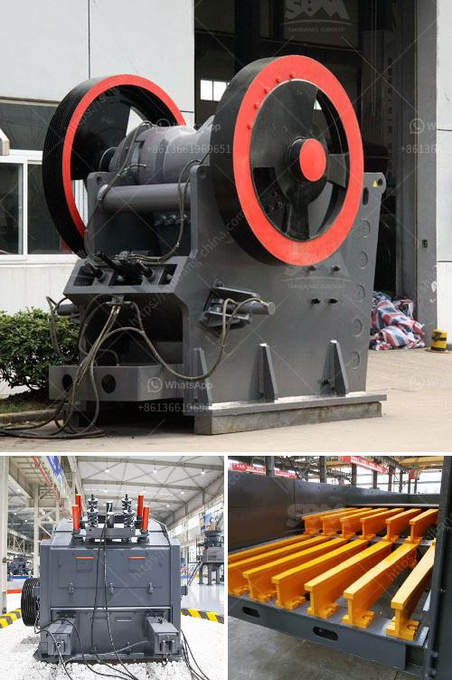

<h3>hammer mill south africa</h3>
When looking for a versatile grinding machine to handle various tasks in your business, the hammer mill in South Africa is an option worth considering. With the ability to reduce material particles down to fine sizes, the hammer mill is a cost-effective solution that provides a high level of size reduction.

Hammer mills are typically used for crushing and grinding materials into smaller particles. They are primarily used in industries such as agriculture, pharmaceutical, and mining where the grinding process is required to be efficient and reliable. The hammer mill is an essential piece of equipment in numerous industries because of its versatility and cost-effectiveness.

One of the key advantages of a hammer mill in South Africa is its low cost. This makes it an ideal choice for small-scale businesses and industries that are on a tight budget. With its simple construction and dependable performance, the hammer mill offers an affordable way to process a wide variety of materials.

In addition to its affordability, the hammer mill is also known for its efficiency. It can quickly process large volumes of materials, reducing them into smaller, more manageable sizes. This is particularly useful in industries such as agriculture, where animal feed needs to be processed efficiently and quickly. By using a hammer mill, farmers can save both time and money by producing their own feed on-site, rather than purchasing expensive pre-processed feed.

Another advantage of using a hammer mill in South Africa is the ability to produce a wide range of end products, such as flour and meal. This is due to the fast and efficient grinding action of the machine, which is able to process various ingredients in different proportions to produce a homogeneous and fine product. This flexibility allows businesses to diversify their product range without investing in additional machinery.

Furthermore, the hammer mill is a robust and durable machine that is built to last. It is designed to withstand the demanding conditions of industries such as mining, construction, and agriculture, where it may be subjected to heavy use and abuse. This ensures that businesses can rely on the hammer mill to perform consistently and efficiently over an extended period.

In conclusion, the hammer mill in South Africa is an affordable and versatile grinding machine that provides high levels of size reduction. It is ideal for small-scale businesses and industries that are on a tight budget. The hammer mill offers efficiency and flexibility, allowing various end products to be produced. Additionally, it is a durable and robust machine that is built to withstand demanding conditions. Whether for crushing or grinding purposes, the hammer mill is a great choice for any business looking to enhance its productivity and profitability.
<h3>Contact us</h3><ul><li><strong>Whatsapp:&nbsp;<a href="https://wa.me/8613661969651">+8613661969651</a></strong></li><li><a href="https://swt.shibang-china.com/?git&amp;zhl&amp;hammer mill south africa"><strong>Online Service(chat now)</strong></a></li></ul><h3>Related</h3><ul><li><a href='roller mill advantages.md'>roller mill advantages</a></li><li><a href='gypsum board manufacturing machines prices inindia.md'>gypsum board manufacturing machines prices inindia</a></li><li><a href='vibrating screen for recycling costs.md'>vibrating screen for recycling costs</a></li><li><a href='rock crusher in africa.md'>rock crusher in africa</a></li><li><a href='small scale gold ball mill.md'>small scale gold ball mill</a></li></ul>