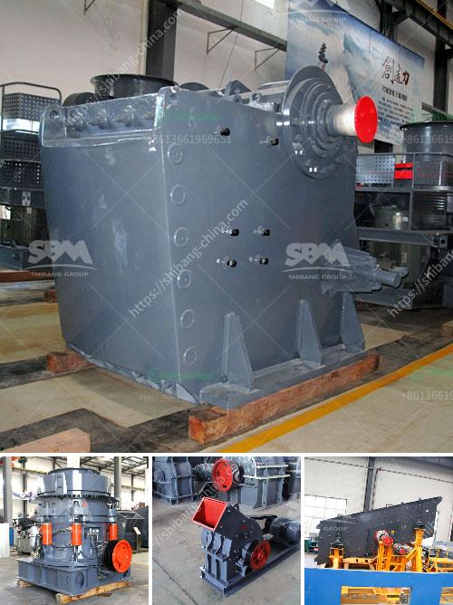

<h3>hammer mill supplier in pretoria</h3>
When it comes to grinding grains and other raw materials, hammer mills play a vital role in a variety of industries. These machines are used to crush or grind various materials into smaller particles, making them suitable for further processing or use in different applications. In Pretoria, South Africa, finding a reliable hammer mill supplier is essential to ensure that you get high-quality equipment that meets your specific requirements.

One of the leading suppliers of hammer mills in Pretoria is XYZ Engineering. With years of experience and expertise in the industry, XYZ Engineering has become a trusted name when it comes to providing top-notch equipment for grinding and crushing applications. Their hammer mills are known for their durability, reliability, and efficient performance, making them the go-to choice for many businesses in Pretoria and its surrounding areas.

One of the key features of the hammer mills supplied by XYZ Engineering is their versatility. These machines can handle a wide range of materials, including grains, herbs, spices, and even small wood chips. This versatility makes them suitable for various industries, such as agriculture, food processing, pharmaceuticals, and more. Whether you need to grind corn, wheat, or any other raw material, XYZ Engineering's hammer mills can deliver consistent results with minimal maintenance required.

Another important aspect to consider when choosing a hammer mill supplier is the quality of the equipment they provide. XYZ Engineering takes pride in manufacturing their hammer mills using high-quality materials and advanced technology. This ensures that their machines are built to last and can withstand the rigors of heavy-duty grinding operations. Additionally, the company follows strict quality control measures to ensure that every unit meets the highest standards before leaving their facility.

In addition to the quality of their equipment, XYZ Engineering also offers excellent customer service. Their team of knowledgeable professionals is dedicated to helping clients find the right hammer mill solution for their specific needs. They take the time to understand your requirements and provide expert advice on the best equipment options available. XYZ Engineering also provides ongoing support after the sale, ensuring that your hammer mill continues to perform optimally throughout its lifespan.

Purchasing a hammer mill from a reputable supplier like XYZ Engineering not only ensures that you get a high-quality product, but it also gives you peace of mind knowing that you are investing in reliable equipment. The durability, versatility, and efficient performance of their hammer mills make them a valuable asset for any business that requires grinding or crushing operations.

In conclusion, finding a reliable hammer mill supplier in Pretoria is crucial for businesses that require efficient grinding and crushing solutions. XYZ Engineering stands out as a trusted supplier in the industry, providing high-quality equipment that is versatile, durable, and backed by excellent customer service. By choosing XYZ Engineering as your hammer mill supplier, you can be confident that you are making a wise investment in equipment that will deliver consistent results for years to come.
<h3>Contact us</h3><ul><li><strong>Whatsapp:&nbsp;<a href="https://wa.me/8613661969651">+8613661969651</a></strong></li><li><a href="https://swt.shibang-china.com/?git&amp;zhl&amp;hammer mill supplier in pretoria"><strong>Online Service(chat now)</strong></a></li></ul><h3>Related</h3><ul><li><a href='manufacturer of slag roller crusher in philippines.md'>manufacturer of slag roller crusher in philippines</a></li><li><a href='manufacturer of silica sand cleaning machines in europe.md'>manufacturer of silica sand cleaning machines in europe</a></li><li><a href='200 tph rock crusher.md'>200 tph rock crusher</a></li><li><a href='calcium phosphate crusher.md'>calcium phosphate crusher</a></li><li><a href='cost for the ball mill machines.md'>cost for the ball mill machines</a></li></ul>