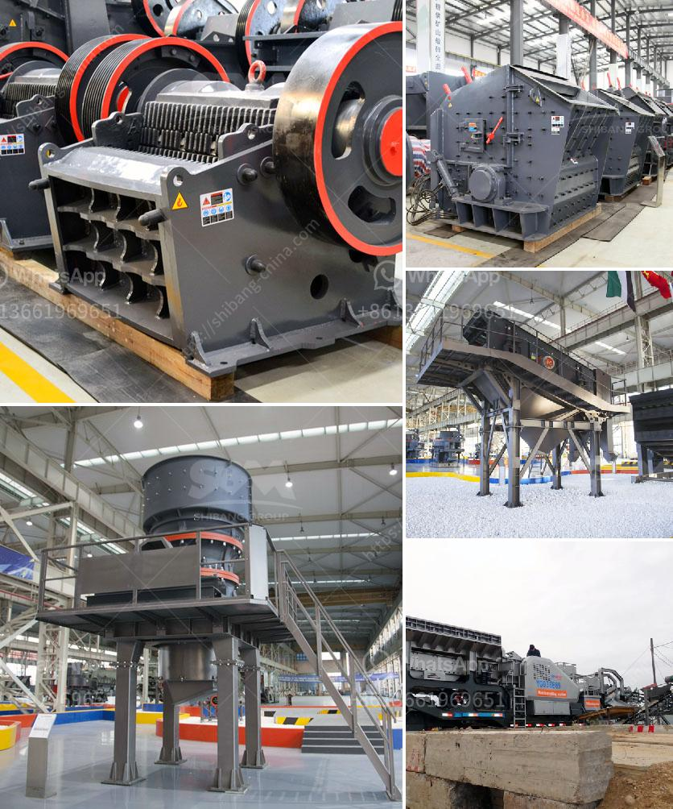

<h3>hammer mill suppliers in kenya</h3>
Hammer mill suppliers in Kenya are facing stiff competition from multinational and domestic companies. The construction of various road projects in Kenya has created increased demand for aggregates, which has led to a surge in the number of hammer mill suppliers in the country.

Hammer mills play a crucial role in crushing different types of materials into smaller pieces. They are widely used in the mining, construction, and manufacturing industries. These machines are designed to crush and grind large-sized materials, such as rocks, stones, and minerals. They are efficient in reducing the size of the material to make it suitable for further processing.

In Kenya, the demand for hammer mills has been rising due to infrastructure development projects. The government's focus on road construction and other infrastructure initiatives has led to an increase in demand for construction materials. This has created a favorable market for hammer mill suppliers as they provide a crucial component in the production of aggregates.

The competition among hammer mill suppliers in Kenya is intense, with both local and international players vying for market share. Local suppliers have the advantage of being familiar with the market dynamics and customer preferences. On the other hand, international suppliers bring in advanced technology and expertise, offering a wider range of products and services.

To stay competitive in the market, hammer mill suppliers in Kenya need to ensure they offer high-quality products at competitive prices. They also need to provide excellent customer service, ensuring timely delivery and after-sales support. Additionally, these suppliers should constantly update their technology and invest in research and development to stay ahead of the competition.

In conclusion, the increasing demand for aggregates in Kenya has led to a rise in the number of hammer mill suppliers. These suppliers play a crucial role in the construction industry, providing machines that crush and grind large-sized materials into smaller particles. To remain competitive, suppliers must constantly innovate and provide excellent customer service to meet the demands of the market.
<h3>Contact us</h3><ul><li><strong>Whatsapp:&nbsp;<a href="https://wa.me/8613661969651">+8613661969651</a></strong></li><li><a href="https://swt.shibang-china.com/?git&amp;zhl&amp;hammer mill suppliers in kenya"><strong>Online Service(chat now)</strong></a></li></ul><h3>Related</h3><ul><li><a href='russia copper ore crushing plant.md'>russia copper ore crushing plant</a></li><li><a href='limestone processing limestone processing plant.md'>limestone processing limestone processing plant</a></li><li><a href='hand ball mill in south africa.md'>hand ball mill in south africa</a></li><li><a href='concrete crusher for sale used in canada.md'>concrete crusher for sale used in canada</a></li><li><a href='vertical vertical roller mill drives.md'>vertical vertical roller mill drives</a></li></ul>