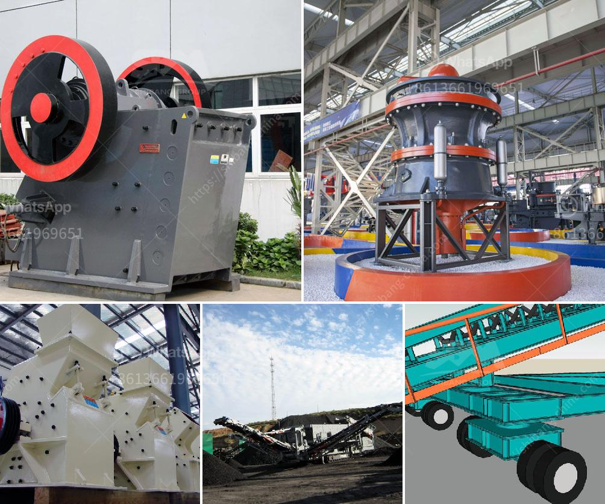

<h3>hammer mills for rocks</h3>
Hammer mills for rocks are versatile machines used to crush, grind, or pulverize materials with low hardness levels. They are well-known in various industries, including mining, agriculture, and construction. The primary purpose of these mills is to reduce the size of the rocks by impacting them with hammers. This article will explore the functionality, benefits, and considerations related to hammer mills for rocks.

The basic operation of a hammer mill involves a central rotor or shaft with rotating hammers attached to it. The material to be crushed is fed into the mill through a feed chute and then subjected to the continuous hammering action. The hammers, rotating at high speed, strike the material, gradually reducing its size.

One of the key advantages of using a hammer mill for rocks is its ability to produce a consistent particle size. Rocks with low hardness have a tendency to break unevenly, resulting in varying particle sizes. However, hammer mills utilize the dynamic impact of the hammers to crush the material uniformly, ensuring a more consistent particle size distribution.

Another advantage of using a hammer mill is its versatility. These machines can handle a wide range of materials, including rocks, minerals, agricultural products, and more. Whether you're processing stones, gravel, or even ore, a hammer mill can efficiently break them down into smaller particles. This versatility makes hammer mills an ideal choice for various applications across different industries.

In the mining industry, hammer mills are commonly used to crush rocks into smaller sizes for further processing. They can be used in both primary and secondary crushing stages, reducing the rocks to a desired size. These mills are also useful in the production of aggregates for construction purposes. By processing large rocks into smaller, more manageable sizes, hammer mills facilitate the preparation of materials used in road construction, building foundations, and concrete production.

For farmers, hammer mills offer the benefit of readily processing agricultural products such as grains, corn, and stalks for livestock feed. They can also be used to pulverize biomass materials, such as wood chips or straw, to produce pellets for fuel or animal bedding.

When considering the use of a hammer mill for rocks, it is important to bear in mind certain factors. First and foremost, the hardness and abrasiveness of the material being processed should be considered. While hammer mills can effectively crush rocks with low hardness, extremely hard rocks may cause excessive wear and tear on the hammers and other components.

Secondly, the desired particle size should be taken into account. Different hammer mills come with varying mesh sizes, allowing for the production of different particle sizes. Choosing the appropriate mesh size plays a crucial role in achieving the desired final product.

In conclusion, hammer mills for rocks are versatile machines that effectively crush, grind, or pulverize materials with low hardness levels. Their ability to produce a consistent particle size, coupled with their versatility, makes them essential in various industries. Whether used in mining, agriculture, or construction, hammer mills offer an efficient and reliable solution for reducing the size of rocks and other materials.
<h3>Contact us</h3><ul><li><strong>Whatsapp:&nbsp;<a href="https://wa.me/8613661969651">+8613661969651</a></strong></li><li><a href="https://swt.shibang-china.com/?git&amp;zhl&amp;hammer mills for rocks"><strong>Online Service(chat now)</strong></a></li></ul><h3>Related</h3><ul><li><a href='crusher information cone crusher mine.md'>crusher information cone crusher mine</a></li><li><a href='blue metal crusher product machine price coimbatore.md'>blue metal crusher product machine price coimbatore</a></li><li><a href='raymond mill from china best supplier on sale.md'>raymond mill from china best supplier on sale</a></li><li><a href='low speed crusher suppliers in china.md'>low speed crusher suppliers in china</a></li><li><a href='price of mini cement plant india.md'>price of mini cement plant india</a></li></ul>