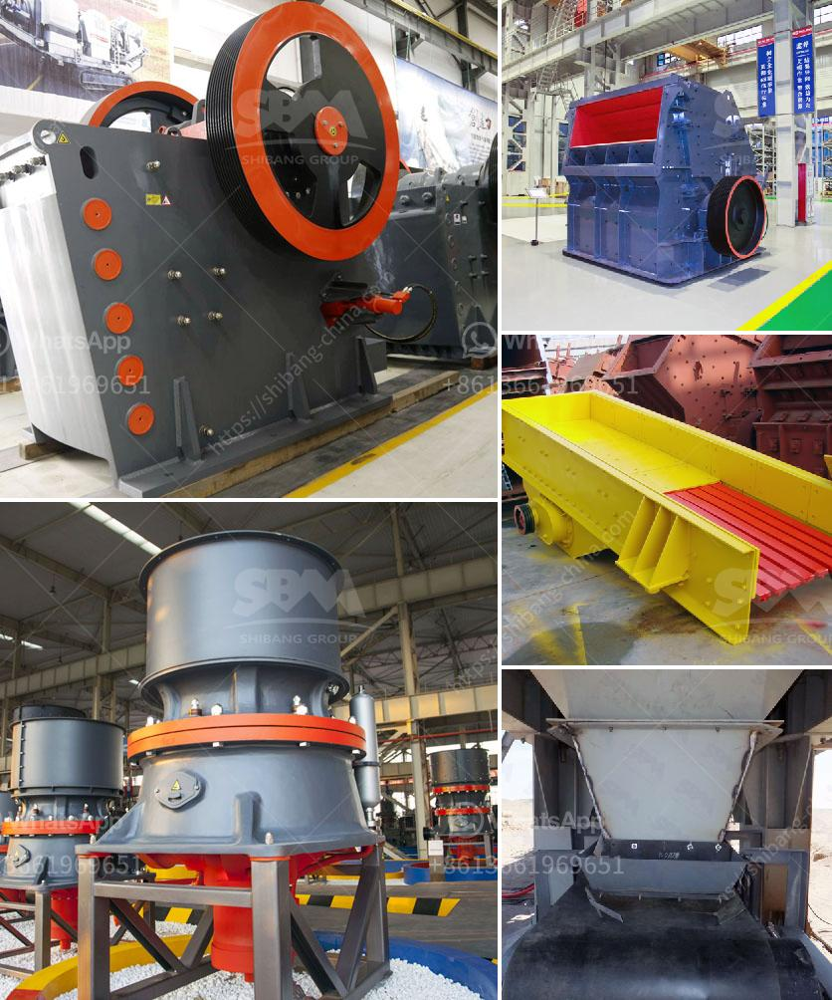

<h3>hammer mills for sale in south africa</h3>
Hammer mills for sale in South Africa are widely used in grinding materials into small particles. These machines are designed with high efficiency and low energy consumption. Depending on the requirements of the material processing, hammer mills can be used in various industries and fields to reduce the size of raw materials.

A hammer mill for sale in South Africa consists of a rotor that rotates at high speed and a series of hammers attached to the rotor. When the rotor is in motion, the hammers swing outward and deliver the material for further processing. The size of the final product depends on the size of the screen used in the hammer mill.

One of the main advantages of using a hammer mill is its versatility. These machines can handle a wide range of materials, including grains, corn, soybeans, straw, herbs, wood chips, and even small tree branches. This makes hammer mills suitable for use in both small and large scale industries.

In the agriculture industry, farmers can use hammer mills to grind grains into fine powder for animal feed. These machines are also used to shred crop residuals, such as corn stalks or straw, for compost production. Hammer mills are known for their ability to produce consistent particle sizes, allowing farmers to achieve optimal nutrition for their livestock.

In the recycling industry, hammer mills are used to reduce the size of waste materials, such as plastic, rubber, paper, and cardboard. This process helps to facilitate the recycling process by making the materials easier to handle and transport. Hammer mills are essential equipment in waste management plants and recycling centers.

The mining industry also utilizes hammer mills to pulverize ore into smaller particles for further processing. This is particularly relevant in gold mining, where multiple stages of crushing and grinding are required to extract the precious metal. Hammer mills are used to break down rocks, lumps of ore, and other hard and abrasive materials efficiently and effectively.

When looking for hammer mills for sale in South Africa, it is essential to consider the quality and reputation of the manufacturer. Buying from a reputable supplier will ensure that the machine is reliable, durable, and will meet your specific requirements. It is also advisable to check the warranty and after-sales service provided by the manufacturer.

In conclusion, hammer mills for sale in South Africa are versatile machines that can be used in various industries. They are widely used in the agricultural, recycling, and mining sectors to reduce the size of materials for further processing. When purchasing a hammer mill, it is important to choose a reputable manufacturer to ensure the machine's quality and longevity.
<h3>Contact us</h3><ul><li><strong>Whatsapp:&nbsp;<a href="https://wa.me/8613661969651">+8613661969651</a></strong></li><li><a href="https://swt.shibang-china.com/?git&amp;zhl&amp;hammer mills for sale in south africa"><strong>Online Service(chat now)</strong></a></li></ul><h3>Related</h3><ul><li><a href='stone crusher kapasitas 150m.md'>stone crusher kapasitas 150m</a></li><li><a href='stone crushers price.md'>stone crushers price</a></li><li><a href='24 x 15 jaw crusher zenith.md'>24 x 15 jaw crusher zenith</a></li><li><a href='quarry crusher machinery for sale.md'>quarry crusher machinery for sale</a></li><li><a href='ballast crusher price in kenya.md'>ballast crusher price in kenya</a></li></ul>