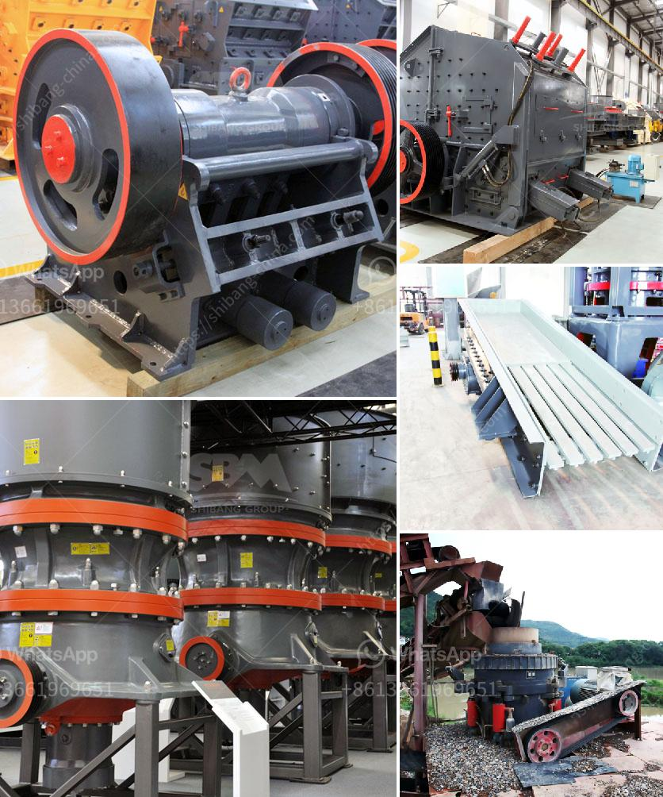

<h3>hammer mills kenya</h3>
Hammer mills have become a fundamental aspect of the agricultural sector in Kenya, as they are a cheaper alternative to traditional milling methods. Homesteaders, small farmers, and large-scale farmers alike have recognized the immense benefits that these machines provide, increasing the demand for hammer mills across the country.

A hammer mill is a crushing machine that crushes and shatters hard and risky materials such as glass, plastic, metals, and even agricultural products such as maize, sunflower, sorghum, and bananas. Hammer mills are designed with simple features that allow easy operation and maintenance.

In diverse agricultural communities in Kenya, there is a constant need to process and grind various food products that include maize, sorghum, beans, and many more. Hammer mills have played a significant role in aiding farmers to transform these grains into livestock feeds or flour for sale. Additionally, hammer mills have also been used to shred agricultural waste, such as corn stalks and maize cobs, for easier disposal or for use as animal bedding.

One of the key advantages of using a hammer mill is that it can produce a consistent and uniform particle size, which is essential for animal feed production. Animals derive maximum nutritional benefits when their feed is milled to a specific particle size, ensuring efficient digestion. Hammer mills allow for easy adjustment of the particle size, depending on the desired outcome. This versatility makes them a suitable choice for farmers who produce feed for different livestock species.

The affordability of hammer mills is another reason why they have gained popularity in Kenya. Unlike the expensive and complex milling machines that dominate the market, hammer mills are relatively cheap and easy to maintain. They are designed to consume low energy, allowing small-scale farmers to operate them effortlessly without incurring huge electricity bills. The ease of operation and low maintenance cost have made hammer mills a favorite among farmers in rural areas and homesteaders who require an affordable and reliable milling solution.

Moreover, the localized manufacturing and distribution networks for hammer mills in Kenya have made them easily accessible to farmers in remote and marginalized areas. Many local entrepreneurs have taken advantage of this opportunity, setting up small manufacturing plants that produce high-quality machines at affordable prices. This decentralization has boosted the local economy and provided employment opportunities for many Kenyans.

Hammer mills have also become a key component in the government's efforts to reduce post-harvest losses and enhance food security. By enabling farmers to process and store their grain efficiently, hammer mills have played a significant role in minimizing waste during the harvest season. This development has had a positive impact on the income of farmers, as they can now maximize their profits by selling processed and value-added products.

In conclusion, hammer mills have revolutionized the agricultural landscape in Kenya. They have become an indispensable tool for farmers, allowing them to process their grain efficiently and produce quality animal feed or flour. With their affordability, ease of use, and low maintenance costs, hammer mills have made milling accessible and profitable for both small-scale and large-scale farmers. As the demand for hammer mills continues to grow, local entrepreneurs are stepping in to meet this demand, stimulating economic growth and creating employment opportunities. The future of farming in Kenya looks brighter with the continued use and advancement of hammer mills.
<h3>Contact us</h3><ul><li><strong>Whatsapp:&nbsp;<a href="https://wa.me/8613661969651">+8613661969651</a></strong></li><li><a href="https://swt.shibang-china.com/?git&amp;zhl&amp;hammer mills kenya"><strong>Online Service(chat now)</strong></a></li></ul><h3>Related</h3><ul><li><a href='cost of stone crushing plant.md'>cost of stone crushing plant</a></li><li><a href='metals alloys for ball mill.md'>metals alloys for ball mill</a></li><li><a href='stationary screening for screening process.md'>stationary screening for screening process</a></li><li><a href='gold wash plant equipment in ghana.md'>gold wash plant equipment in ghana</a></li><li><a href='how to make a talcum powder.md'>how to make a talcum powder</a></li></ul>