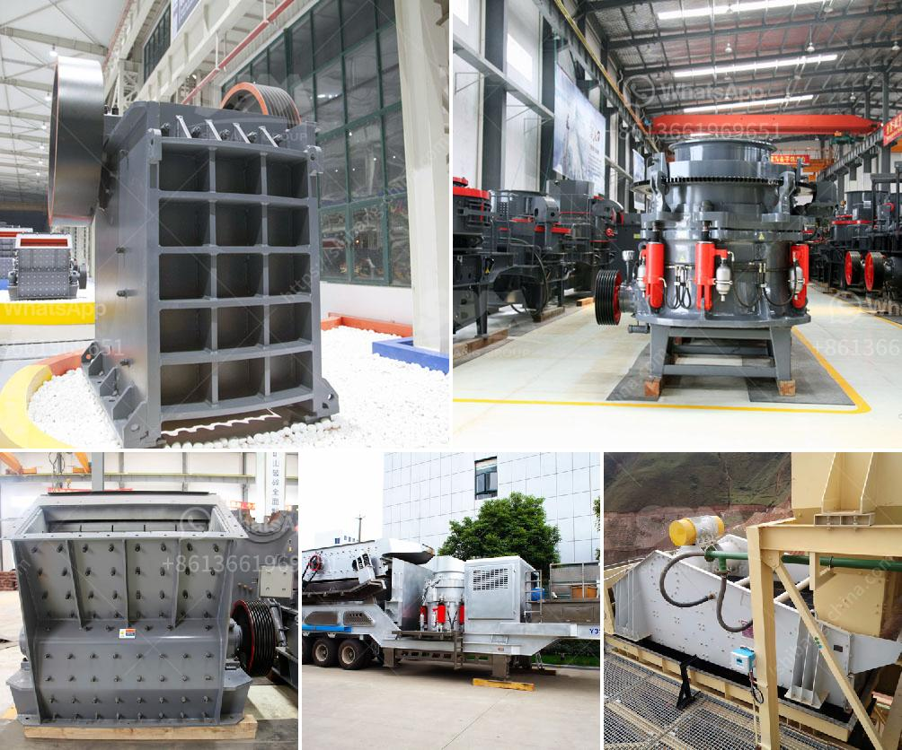

<h3>hammer mills used in kenya</h3>
Agriculture is the backbone of the Kenyan economy and provides employment to over 70% of the population. However, inadequate post-harvest management processes lead to enormous losses, reduce the value of produce, and inhibit the growth of the agro-processing industry. Hammer mills play a crucial role in alleviating these challenges by transforming agricultural waste into valuable feed and fertilizer products.

A hammer mill is a machine used to shred or crush materials into smaller pieces. The basic design of these machines involves a rotating shaft or drum with free-swinging hammers attached. When materials are fed into the hopper, they are crushed by the repeated blows of these hammers. Hammer mills are commonly used for grinding corn, wheat, rice, sorghum, soybeans, and other agricultural products.

In Kenya, they are a vital tool for grinding cereals and other grains. Since most farm activities revolve around the planting and harvesting seasons, hammer mills offer a reliable and cost-effective solution to feed livestock and process crops. With hammer mills, farmers can save a significant amount of time and energy by grinding cereals on their own farms instead of transporting them to distant milling facilities.

Moreover, hammer mills enable farmers to produce uniform and high-quality animal feed, thereby improving the health and productivity of their livestock. The finely ground feed enhances digestion, ensures the complete absorption of nutrients, and leads to higher milk production and weight gain in animals. As such, hammer mills contribute to the overall efficiency and profitability of livestock farming in Kenya.

In addition to feed production, hammer mills find extensive use in the production of organic fertilizers. In Kenya, farmers often face challenges in obtaining high-quality organic fertilizers due to limited availability and high costs. Hammer mills can process agricultural residues and animal manure to produce finely ground organic fertilizers rich in essential nutrients. By using these fertilizers, farmers can significantly improve the soil fertility, resulting in increased crop yields and reduced reliance on synthetic fertilizers.

Another benefit of hammer mills is that they provide a source of income to smallholder farmers. In addition to grinding their own grains and producing animal feed, farmers can also generate revenue by offering milling services to neighboring farms. This additional income helps to improve their livelihoods and invest in other aspects of their farming activities.

Despite their numerous benefits, hammer mills face various challenges in Kenya. One major issue is the high cost of acquiring and maintaining these machines. The price of hammer mills has often limited their acquisition by smallholder farmers, thereby limiting access to the benefits they offer. Furthermore, limited knowledge about the use and maintenance of hammer mills prevents their full utilization.

To address these challenges, government agencies, non-profit organizations, and private enterprises need to partner to provide financial support, training, and awareness campaigns. Offering subsidies or low-interest loans can make hammer mills more affordable for smallholder farmers. Furthermore, training programs on the operation, maintenance, and repair of hammer mills can enhance their longevity and efficiency.

In conclusion, hammer mills are a vital tool in the agricultural industry in Kenya, as they provide a cost-effective solution for grinding cereals, producing animal feed, and manufacturing organic fertilizers. With proper utilization, these machines can improve livestock productivity, crop yields, and smallholder farmers' income levels.
<h3>Contact us</h3><ul><li><strong>Whatsapp:&nbsp;<a href="https://wa.me/8613661969651">+8613661969651</a></strong></li><li><a href="https://swt.shibang-china.com/?git&amp;zhl&amp;hammer mills used in kenya"><strong>Online Service(chat now)</strong></a></li></ul><h3>Related</h3><ul><li><a href='river stone crusher.md'>river stone crusher</a></li><li><a href='crusher for limestone.md'>crusher for limestone</a></li><li><a href='how to make a roller mill.md'>how to make a roller mill</a></li><li><a href='micro powder grinder mill.md'>micro powder grinder mill</a></li><li><a href='stone gravel crusher price at ranchi.md'>stone gravel crusher price at ranchi</a></li></ul>