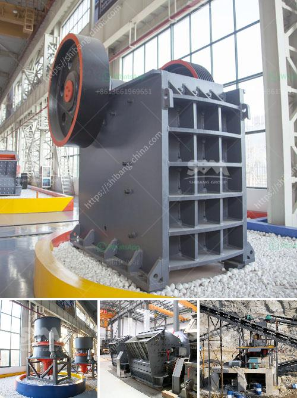

<h3>hand ball mill in south africa</h3>
Handball has been gaining popularity in South Africa over the past decade, with the establishment of local handball clubs and the participation of South African teams in international tournaments. One vital component of the sport's success is the handball mill, a facility that has revolutionized the training and development of handball players in the country.

The handball mill is a specially designed indoor arena that resembles a football pitch. It consists of a synthetic turf field enclosed by high walls and equipped with nets at both ends. The size of the handball mill allows players to practice various techniques in a controlled environment, promoting growth and skill acquisition.

In South Africa, handball was historically overshadowed by more mainstream sports like rugby and soccer. However, as the interest in alternative sports grew, the need for specialized training facilities emerged. The handball mill was developed to facilitate this need and provide players with a dedicated space to train and hone their skills.

The handball mill serves multiple purposes. Firstly, it allows players to practice their ball handling, shooting, and passing skills at a faster pace due to the confined space. The walls act as an additional player, enabling players to practice ball rebounds and improving their overall control and dexterity. This intense training environment greatly enhances players' decision-making abilities, responsiveness, and quick thinking, which are crucial skills in handball.

Additionally, the handball mill eliminates external factors like weather conditions, which can hinder outdoor training sessions. Players can conveniently train year-round, regardless of rain or extreme heat. This indoor facility also provides a safe and controlled environment, minimizing the risk of injuries and accidents during training sessions.

Furthermore, the handball mill has become a hub for handball enthusiasts in South Africa. It offers a platform for players to network, share ideas, and collaborate on improving the sport. Local clubs use the handball mill as their home ground, hosting matches, tournaments, and training camps. This has fostered a sense of community among handball players and supporters and has contributed to the growth and development of the sport across the country.

The handball mill has had a significant impact on South African handball. It has allowed the sport to flourish by providing professional training facilities that cater to the specific needs of handball players. The improved training environment has resulted in increased skill levels, tactical awareness, and overall performance of South African handball teams.

Looking ahead, the continued investment in handball mills throughout South Africa is crucial for the sustained growth and competitiveness of the sport. As more players gain access to these facilities, handball will continue to thrive, drawing in more participants and spectators alike. The handball mill has undoubtedly played a pivotal role in putting handball on the map in South Africa and paving the way for future success.
<h3>Contact us</h3><ul><li><strong>Whatsapp:&nbsp;<a href="https://wa.me/8613661969651">+8613661969651</a></strong></li><li><a href="https://swt.shibang-china.com/?git&amp;zhl&amp;hand ball mill in south africa"><strong>Online Service(chat now)</strong></a></li></ul><h3>Related</h3><ul><li><a href='enquiry impact crusher.md'>enquiry impact crusher</a></li><li><a href='major advantage of impact cone crusher.md'>major advantage of impact cone crusher</a></li><li><a href='gypsum board plant cost.md'>gypsum board plant cost</a></li><li><a href='ball mill manufacturers gypsum.md'>ball mill manufacturers gypsum</a></li><li><a href='dolomite crushing plant price in india.md'>dolomite crushing plant price in india</a></li></ul>