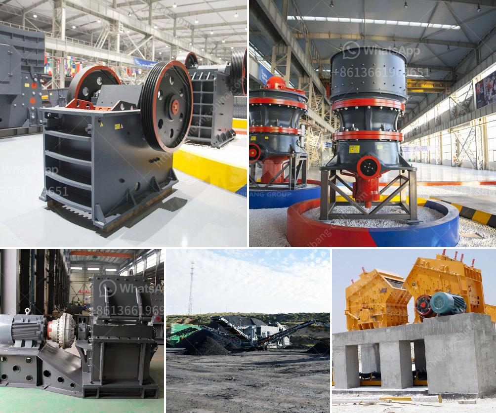

<h3>hand crank oyster shell crusher</h3>
The hand crank oyster shell crusher is a simple yet effective tool for crushing oyster shells. With its durable and compact design, it allows you to crush oyster shells consistently and effortlessly. This tool can be used for both personal and professional purposes.

Oyster shells are a valuable resource in various industries, including agriculture, construction, and landscaping. They are used as a natural supplement for animal feed, as well as a soil amendment to improve calcium levels and pH balance. However, before they can be utilized, the shells need to be crushed into smaller particles.

The hand crank oyster shell crusher solves this problem by providing a mechanical solution for crushing oyster shells. With the crank handle, you can effortlessly turn the crusher and gradually crush the shells into the desired consistency. The compact size of this crusher makes it easy to store and transport, making it ideal for both home and field use.

Furthermore, the hand crank oyster shell crusher is built to last. It is made from high-quality materials that can withstand the pressure of repetitive crushing. Its sturdy construction ensures that it will not break or deform, even after prolonged use.

Not only is the hand crank oyster shell crusher practical and durable, but it is also environmentally friendly. By crushing oyster shells, you are reducing waste and allowing for the reuse of this valuable resource. Additionally, crushed oyster shells can be used as an alternative to chemical fertilizers, contributing to sustainable and organic farming practices.

In conclusion, the hand crank oyster shell crusher is an excellent tool for efficiently crushing oyster shells. Its compact and durable design allows for easy use and transport, while its environmental benefits make it a fantastic choice for anyone involved in the agricultural or construction industry. Invest in this convenient tool to make the most out of oyster shells and contribute to a greener future.
<h3>Contact us</h3><ul><li><strong>Whatsapp:&nbsp;<a href="https://wa.me/8613661969651">+8613661969651</a></strong></li><li><a href="https://swt.shibang-china.com/?git&amp;zhl&amp;hand crank oyster shell crusher"><strong>Online Service(chat now)</strong></a></li></ul><h3>Related</h3><ul><li><a href='proposal for sand crushing machines industry.md'>proposal for sand crushing machines industry</a></li><li><a href='used track mounted stone crusher.md'>used track mounted stone crusher</a></li><li><a href='enquiry crushing machine.md'>enquiry crushing machine</a></li><li><a href='hot selling coal mine roller crushing plant in india.md'>hot selling coal mine roller crushing plant in india</a></li><li><a href='plant of quartz poweder is salling out.md'>plant of quartz poweder is salling out</a></li></ul>