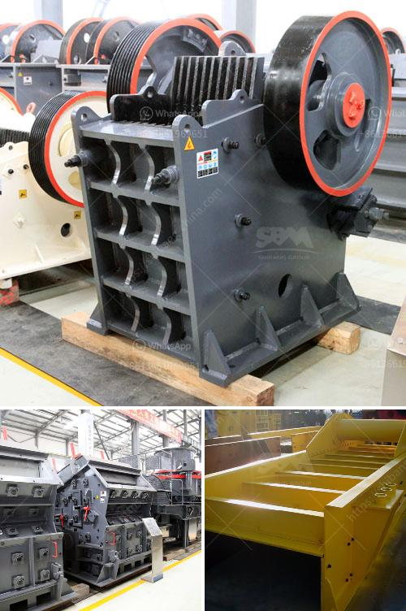

<h3>hard stone crush maker pakistan</h3>
Hard stone crush maker Pakistan refers to a machine that is used to crush hard stones into various sizes for construction purposes. In Pakistan, where the construction industry is booming, the need for such machinery has never been greater.

One of the key advantages of using a hard stone crush maker is that it can process rocks and stones of various sizes and hardness levels. This makes it suitable for a wide range of applications, from building foundations and road construction to making concrete and asphalt.

The machine works by using a high-speed rotating rotor with a heavy-duty hammer bar. The stones are fed into the machine through a hopper, and the hammer bar strikes them repeatedly, breaking them into smaller pieces. The crushed stones then pass through a screen to achieve the desired size.

Hard stone crush makers in Pakistan are designed to be reliable and efficient. They are built with strong and durable materials to withstand the harsh operating conditions of construction sites. Additionally, they are equipped with advanced technology, such as a hydraulic system and an adjustable screen, to ensure optimal performance and precision in stone crushing.

The significance of hard stone crush makers in Pakistan cannot be overstated. These machines play a crucial role in the construction industry by providing a steady supply of crushed stones of different sizes. Without them, construction projects would be delayed or even impossible to complete.

Furthermore, hard stone crush makers contribute to the local economy as they create job opportunities for workers involved in their production, operation, and maintenance. They also support the quarrying industry by providing a market for various types of stones found in different regions of Pakistan.

In conclusion, hard stone crush makers have become an essential machinery in the rapidly growing construction industry of Pakistan. They enable the production of high-quality crushed stones in various sizes, supporting the development of infrastructure projects across the country. With their reliability, efficiency, and technological advancements, these machines are set to continue playing a vital role in the future of Pakistan's construction sector.
<h3>Contact us</h3><ul><li><strong>Whatsapp:&nbsp;<a href="https://wa.me/8613661969651">+8613661969651</a></strong></li><li><a href="https://swt.shibang-china.com/?git&amp;zhl&amp;hard stone crush maker pakistan"><strong>Online Service(chat now)</strong></a></li></ul><h3>Related</h3><ul><li><a href='sahuvala roller mills.md'>sahuvala roller mills</a></li><li><a href='marble crusher china.md'>marble crusher china</a></li><li><a href='gypsum recycling equipment for sale.md'>gypsum recycling equipment for sale</a></li><li><a href='double toggle jaw crusher advantages.md'>double toggle jaw crusher advantages</a></li><li><a href='mobile cone crusher zenith.md'>mobile cone crusher zenith</a></li></ul>