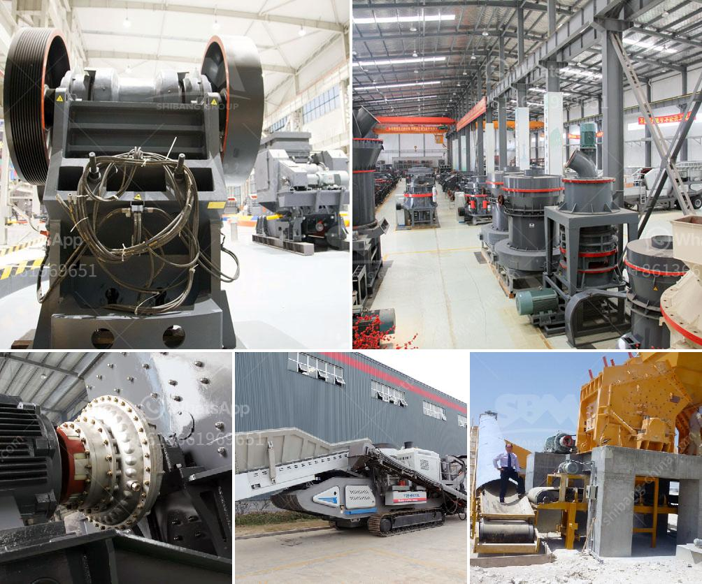

<h3>harga dan tipe stone crusher indonesia</h3>
Stone crusher adalah salah satu mesin yang digunakan untuk menghancurkan batu menjadi ukuran yang lebih kecil. Mesin ini digunakan dalam berbagai industri, seperti pertambangan, konstruksi, metalurgi, kimia, dan lain-lain. 

Di Indonesia, harga stone crusher bervariasi tergantung tipe dan spesifikasinya. Ada beberapa faktor yang mempengaruhi harga stone crusher, di antaranya adalah ukuran, kapasitas, kekuatan motor, dan merek. 

Salah satu tipe stone crusher yang populer di Indonesia adalah jaw crusher. Jaw crusher memiliki dua pelat logam yang berfungsi untuk memecah batu dengan gaya tekan dari atas ke bawah. Kelebihan dari jaw crusher adalah memiliki struktur sederhana, ukuran yang kompak, serta kemudahan dalam pengoperasiannya. Tipe jaw crusher ini umumnya digunakan untuk menghancurkan batu dengan tingkat kekerasan rendah hingga sedang. 

Selain jaw crusher, tipe stone crusher lainnya adalah cone crusher. Cone crusher bekerja dengan cara menghancurkan batu menggunakan kekuatan kompresi antara mantle (mangkuk) dan concave (pelat tetap). Kelebihan dari cone crusher adalah memiliki kapasitas yang lebih besar daripada jaw crusher dan dapat digunakan untuk menghancurkan batu dengan tingkat kekerasan tinggi. Oleh karena itu, cone crusher banyak digunakan dalam industri pertambangan dan konstruksi. 

Tipe stone crusher lainnya adalah impact crusher. Seperti namanya, mesin ini bekerja dengan cara menabrakkan batu ke dinding-dinding dalam ruang penghancur. Impact crusher biasanya digunakan untuk menghancurkan batu dengan tingkat kekerasan tinggi dan memiliki kemampuan dalam menghasilkan butiran batu yang lebih seragam. Mesin ini sering digunakan dalam industri pembangunan jalan dan pembangunan bangunan. 

Harga stone crusher di Indonesia juga dipengaruhi oleh merek. Ada banyak merek stone crusher yang dikenal di Indonesia, seperti Shanbao, Metso, Sandvik, dan lain-lain. Setiap merek memiliki keunggulan dan kelemahan masing-masing. Beberapa merek terkenal umumnya memiliki harga yang lebih tinggi dibandingkan merek lainnya, karena mereka dianggap memiliki kualitas yang lebih baik dan telah terpercaya di industri ini. 

Dalam memilih tipe dan harga stone crusher yang sesuai, Anda perlu mempertimbangkan kebutuhan produksi Anda, jenis batu yang akan dihancurkan, dan anggaran yang tersedia. Jangan hanya fokus pada harga, tapi juga perhatikan kualitas dan after-sales service dari produsen atau distributor stone crusher yang Anda pilih. 

Akhirnya, penting untuk mengingat bahwa mesin stone crusher harus dioperasikan dengan benar dan menggunakan perawatan yang tepat agar dapat berfungsi dengan baik dan tahan lama. Selalu ikuti petunjuk penggunaan dan pelaksanaan perawatan rutin. 

Dalam industri konstruksi dan pertambangan di Indonesia, mesin stone crusher merupakan peralatan yang sangat dibutuhkan. Dengan memilih tipe dan harga stone crusher yang tepat, Anda dapat meningkatkan efisiensi produksi dan menghasilkan hasil yang memuaskan. Semoga artikel ini membantu Anda dalam memahami lebih lanjut tentang harga dan tipe stone crusher di Indonesia.
<h3>Contact us</h3><ul><li><strong>Whatsapp:&nbsp;<a href="https://wa.me/8613661969651">+8613661969651</a></strong></li><li><a href="https://swt.shibang-china.com/?git&amp;zhl&amp;harga dan tipe stone crusher indonesia"><strong>Online Service(chat now)</strong></a></li></ul><h3>Related</h3><ul><li><a href='friendly gold mining equipment.md'>friendly gold mining equipment</a></li><li><a href='second hand stone crushing machines in united kingdom.md'>second hand stone crushing machines in united kingdom</a></li><li><a href='stone crushers kenya.md'>stone crushers kenya</a></li><li><a href='sand crusher for sale.md'>sand crusher for sale</a></li><li><a href='chrome washing plant for sale south africa.md'>chrome washing plant for sale south africa</a></li></ul>