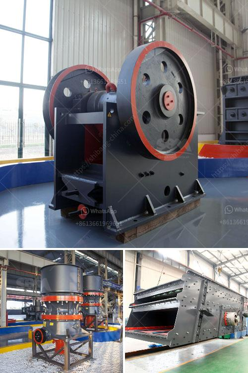

<h3>high capacity stone hammer crusher</h3>
Hammer crusher has been widely used in the mining, cement, coal, metallurgy, building materials, highway and other industries, for its large feed size, high crushing ratio, high output, stable performance, and strong adaptability. Hammer crusher can crush various kinds of materials with different sizes into uniform particle size, such as limestone, coal, gypsum, brick, tile, and other materials. The material humidity should be less than 15% and the compressive strength of the material does not exceed 100 MPa.

One particular type of hammer crusher is the high capacity stone hammer crusher. This hammer crusher is specifically designed for crushing stone and its powerful crushing ability achieves efficient and reliable construction aggregates production results. It is suitable for stone crushing plant with large capacity needs considering the final products' size and shape requirements.

The high capacity stone hammer crusher mainly consists of the frame, rotor, hammers, and grizzly bars. The frame includes upper part and lower parts, which are welded by steel plates after cutting, the remaining parts are connected by bolts. Inside the frame, a rotor is mounted to the main shaft. The hammer rotor consists of a main shaft, disc, pins, and hammers. The motor drives the rotor to rotate at a high speed through the V-belt. The hydraulic coupler connects the motor and the rotor to ensure smooth running.

The hammers are made of high manganese steel, which can withstand impact, wear, and tear. The grizzly bars ensure that large-sized stone materials are evenly screened out before entering the crushing chamber, preventing any potential damage to the hammer crusher. This design ensures the efficiency and reliability of the stone crushing process.

The working principle of the high capacity stone hammer crusher is relatively simple. The raw materials are evenly sent to the crusher by the feeder for crushing. After being crushed, the materials are screened by the vibrating screen. The qualified materials will be discharged through the output port, and the unqualified materials will be returned to the crusher for secondary crushing. This continuous process ensures the production of high-quality construction aggregates.

One of the key features of the high capacity stone hammer crusher is its high production capacity. With a large feeding size of up to 1200mm and a capacity of up to 2200 tons per hour, this machine can meet the crushing requirements of most stone crushing plants. It is often used as a primary crusher in large-scale stone crushing plants, reducing the investment cost and enhancing the efficiency.

In conclusion, the high capacity stone hammer crusher is a powerful stone crushing equipment suitable for large-scale stone crushing plants. It has reliable performance, reasonable design, convenient operation, and high work efficiency. If you are in need of a stone hammer crusher, do not hesitate to contact us for further information. Our professional team will provide you with comprehensive solutions and excellent service.
<h3>Contact us</h3><ul><li><strong>Whatsapp:&nbsp;<a href="https://wa.me/8613661969651">+8613661969651</a></strong></li><li><a href="https://swt.shibang-china.com/?git&amp;zhl&amp;high capacity stone hammer crusher"><strong>Online Service(chat now)</strong></a></li></ul><h3>Related</h3><ul><li><a href='sand vsi crusher.md'>sand vsi crusher</a></li><li><a href='used stone crusher machine for sale in philippines.md'>used stone crusher machine for sale in philippines</a></li><li><a href='how to increase capacity of cement ball mill.md'>how to increase capacity of cement ball mill</a></li><li><a href='simple stone crushing machine price in kenya.md'>simple stone crushing machine price in kenya</a></li><li><a href='small cone crushers.md'>small cone crushers</a></li></ul>