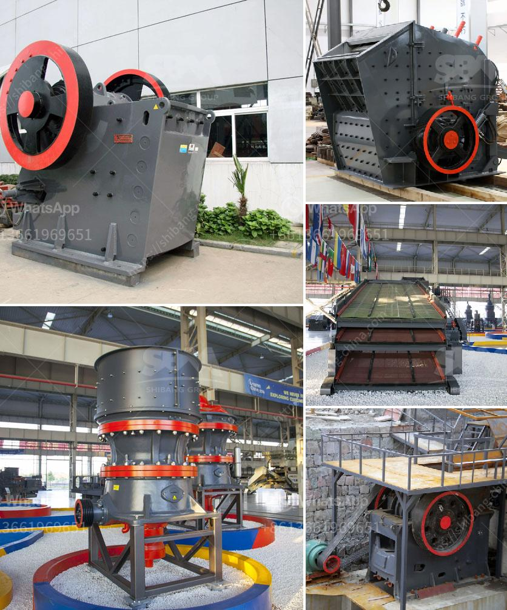

<h3>high efficiency manganese ore raymond mill in india</h3>
India is a leading producer of manganese ore in the world, accounting for about 30% of the total production. With approximately 170 million tons of manganese ore reserves, India ranks among the top five countries globally. The vast availability of this crucial mineral has attracted significant investments in the mining sector.

To extract manganese from the ore, various techniques are employed, including crushing, grinding, and beneficiation. Among these, grinding plays a critical role in achieving the desired particle size and ore liberation. It is at this juncture that high-efficiency manganese ore Raymond mills come into play.

Raymond mills are widely used in the grinding of various non-metallic minerals and materials such as barite, calcite, potassium feldspar, talc, marble, limestone, dolomite, fluorite, lime, activated clay, activated carbon, bentonite, kaolin, cement, phosphate rock, gypsum, glass, and thermal insulation materials. The high-efficiency manganese ore Raymond mill equipment provided by Guilin Hongcheng, a leading manufacturer in the industry, has stable performance, energy-saving and environmental protection advantages, and has been favored and loved by customers.

Among them, the Raymond mill equipment is a renewal of the traditional mill, which can grind 80-400 mesh calcite ore powder. Hongcheng's new Raymond mill equipment is named HC vertical pendulum grinding mill. It is a high-capacity manganese ore mill specially developed by Hongcheng. The grinding mill takes the customer's requirements into account in terms of Raymond mill quality and grinding fineness, featuring high-efficiency production, stable equipment operation, and lower energy consumption.

With the rapid development of the mining industry in India, the demand for high-efficiency manganese ore Raymond mills is growing. Guilin Hongcheng is a well-known and experienced mill manufacturer, providing new environmental protection Raymond mill equipment, helping the mineral powder processing market to improve efficiency and create value.
<h3>Contact us</h3><ul><li><strong>Whatsapp:&nbsp;<a href="https://wa.me/8613661969651">+8613661969651</a></strong></li><li><a href="https://swt.shibang-china.com/?git&amp;zhl&amp;high efficiency manganese ore raymond mill in india"><strong>Online Service(chat now)</strong></a></li></ul><h3>Related</h3><ul><li><a href='stone crusher vibrating screen manila.md'>stone crusher vibrating screen manila</a></li><li><a href='labratory hammer mill.md'>labratory hammer mill</a></li><li><a href='conveyor belt manufacturers in africa.md'>conveyor belt manufacturers in africa</a></li><li><a href='lime stone crusher spesifikasi.md'>lime stone crusher spesifikasi</a></li><li><a href='stone crusher kapasitas 150m.md'>stone crusher kapasitas 150m</a></li></ul>