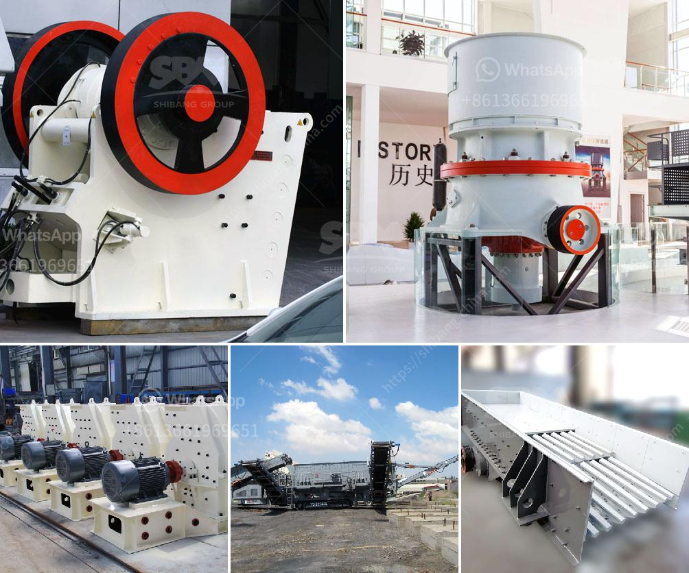

<h3>high energy ball mill india</h3>
High energy ball mill India is widely used in the fields of mining, chemical industry, construction materials, metallurgy and so on. It is suitable for processing various materials, such as quartz, granite, limestone, basalt, iron ore, gold ore, etc. In addition, it is also used for fine grinding of ceramic materials.

The high energy ball mill India consumes less energy when grinding materials due to the unique design of its grinding chamber. The grinding chamber consists of a cylindrical drum inside which a number of grinding balls are placed. The materials are fed into the grinding chamber and collide with the grinding balls, resulting in high energy impacts that break the materials into fine particles.

One of the main advantages of the high energy ball mill India is its ability to possess high production capacity. With a large grinding chamber, this mill can process a large amount of materials at a time, thereby increasing efficiency and saving time. This makes it a cost-effective option for industries that require high productivity.

Moreover, the high energy ball mill India is easy to operate and maintain. It is equipped with an advanced control system that allows users to adjust the rotation speed of the mill, as well as the grinding time and intensity. This enables users to obtain the desired particle size and distribution.

In conclusion, the high energy ball mill India is a versatile and efficient machine that can grind and homogenize various materials. Its unique design and high production capacity make it a valuable asset in many industries.
<h3>Contact us</h3><ul><li><strong>Whatsapp:&nbsp;<a href="https://wa.me/8613661969651">+8613661969651</a></strong></li><li><a href="https://swt.shibang-china.com/?git&amp;zhl&amp;high energy ball mill india"><strong>Online Service(chat now)</strong></a></li></ul><h3>Related</h3><ul><li><a href='price stone crusher.md'>price stone crusher</a></li><li><a href='impact crusher suppliers.md'>impact crusher suppliers</a></li><li><a href='rock crusher equipment.md'>rock crusher equipment</a></li><li><a href='stone sand making machine.md'>stone sand making machine</a></li><li><a href='small rock crusher for small scale aggregate producers.md'>small rock crusher for small scale aggregate producers</a></li></ul>