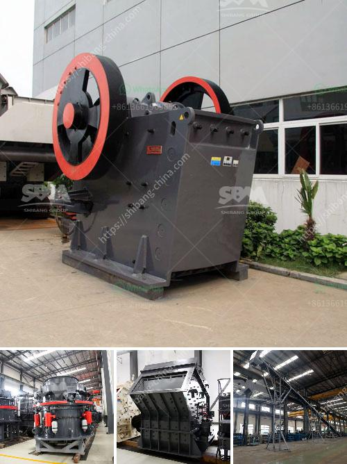

<h3>high purity quartz processing companies</h3>
High purity quartz has become a key material in various industries due to its exceptional properties. It is a type of quartz that contains more than 99.997% silica, making it suitable for a wide range of applications, such as electronics, optics, solar panels, and semiconductors. The demand for high purity quartz has been on the rise, leading to the emergence of several processing companies catering to this specialized market.

One of the leading global players in high purity quartz processing is The Quartz Corp. The company operates several production plants across the world and is committed to delivering high-quality products to its customers. They have implemented state-of-the-art techniques and technologies in their processing facilities to ensure the highest level of purity and consistency in their quartz products.

The Quartz Corp follows a stringent quality control process starting from the mining of quartz ore to the final product. The mined quartz undergoes rigorous purification processes to eliminate any impurities that may affect its quality. The company also invests in advanced technologies like flotation to separate undesirable minerals from the quartz, resulting in a product with exceptional purity levels.

Another major player in the high purity quartz market is Sibelco Group. They have a dedicated division known as Sibelco IOTA, which specializes in producing high purity quartz for various applications. The company operates multiple processing plants globally, ensuring a reliable supply of high-quality quartz to its customers.

Sibelco IOTA focuses on sustainable and responsible mining practices to minimize its environmental footprint. They are committed to conducting thorough environmental assessments and implementing suitable measures to mitigate any potential impacts. By prioritizing sustainability, Sibelco IOTA aims to provide high purity quartz while minimizing its carbon footprint.

Other prominent high purity quartz processing companies include HPQ Silicon Resources Inc. and Jiangsu Pacific Quartz Co. Ltd. These companies have also built a reputation for delivering high-quality quartz products through efficient processing techniques.

In conclusion, the demand for high purity quartz has driven the establishment of several companies specializing in its processing. These companies invest in advanced technologies and follow strict quality control measures to ensure the production of high-quality, high purity quartz. With the increasing importance of high purity quartz in various industries, these processing companies play a critical role in meeting the market demand and supporting technological advancements.
<h3>Contact us</h3><ul><li><strong>Whatsapp:&nbsp;<a href="https://wa.me/8613661969651">+8613661969651</a></strong></li><li><a href="https://swt.shibang-china.com/?git&amp;zhl&amp;high purity quartz processing companies"><strong>Online Service(chat now)</strong></a></li></ul><h3>Related</h3><ul><li><a href='quartz plants in india.md'>quartz plants in india</a></li><li><a href='blands of quarry crusher plant ball mill.md'>blands of quarry crusher plant ball mill</a></li><li><a href='vertical mill machine in cement industry.md'>vertical mill machine in cement industry</a></li><li><a href='want to increase productivity for stone crushers.md'>want to increase productivity for stone crushers</a></li><li><a href='cone crusher for sale in uae.md'>cone crusher for sale in uae</a></li></ul>