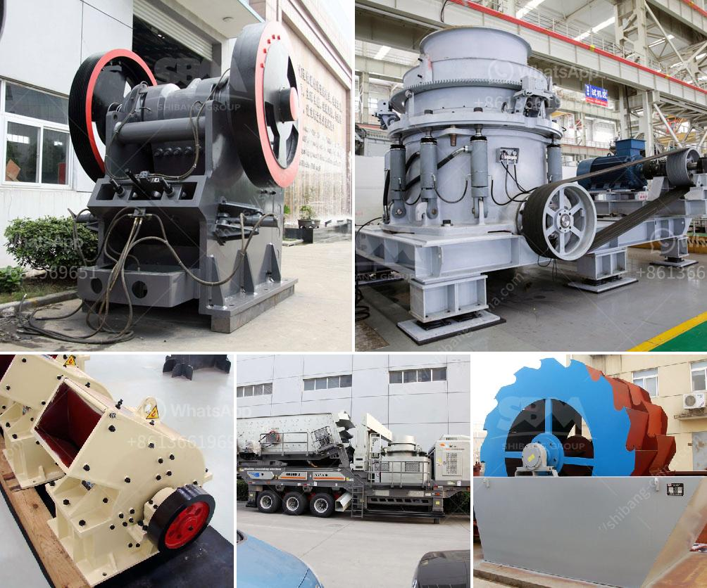

<h3>hot selling coal mine roller crushing plant in india</h3>
India is rich in coal resources, contributing to the growth and development of the nation's economy. With coal being the primary source of energy for various industries, it is crucial to have efficient and reliable crushing plants in place. The hot-selling coal mine roller crushing plant in India is revolutionizing the mining industry, paving the way for a brighter and more sustainable future.

Coal has been a significant part of India's energy mix for decades, fulfilling the ever-increasing demand for power generation, steel production, and other industrial processes. However, the traditional methods of coal extraction and processing have proved to be inefficient, time-consuming, and detrimental to the environment. This is where the coal mine roller crushing plant comes into play.

The coal mine roller crushing plant is a highly reliable and technologically advanced machine. It offers an efficient and low-cost solution for crushing and reducing the size of coal stones. It is widely used in various coal mining applications, making it a highly sought-after product in the market.

One of the standout features of the coal mine roller crushing plant is its ability to crush coal into different sizes, making it suitable for a variety of industrial processes. It can crush the coal to the required size for power generation, thereby eliminating the need for additional grinding or crushing machinery. This not only saves time and resources but also reduces the overall carbon footprint.

Another striking characteristic of the coal mine roller crushing plant is its mobility. The plant can be easily transported and set up at different mining sites, ensuring maximum efficiency and productivity. This flexibility makes it an ideal choice for both large-scale coal mining operations and smaller, more remote locations.

The coal mine roller crushing plant is also designed with safety in mind. It is equipped with advanced safety features to protect workers from potential hazards, ensuring a safe working environment. This is crucial in the mining industry, where safety should always be a top priority.

In addition to its efficiency, versatility, and safety features, the coal mine roller crushing plant also boasts a user-friendly interface and low maintenance requirements. Its innovative design allows for easy operation and maintenance, minimizing downtime and maximizing productivity.

The demand for the hot-selling coal mine roller crushing plant in India is driven by the need for more sustainable and efficient coal mining practices. This revolutionary machine offers a solution to the long-standing challenges faced by the industry, such as environmental degradation, inefficient extraction methods, and the need for additional processing machinery.

The coal mine roller crushing plant is not only transforming the way coal mining is conducted in India but also setting new standards in the global mining industry. With its advanced technology, efficiency, and sustainability, it is paving the way for a more sustainable and greener future.

In conclusion, the hot-selling coal mine roller crushing plant in India is a game-changer in the mining industry. It offers a sustainable and efficient solution for crushing coal, reducing its size, and making it suitable for various industrial processes. With its mobility, safety features, and user-friendly interface, it is revolutionizing coal mining practices, driving the industry towards a brighter and more sustainable future.
<h3>Contact us</h3><ul><li><strong>Whatsapp:&nbsp;<a href="https://wa.me/8613661969651">+8613661969651</a></strong></li><li><a href="https://swt.shibang-china.com/?git&amp;zhl&amp;hot selling coal mine roller crushing plant in india"><strong>Online Service(chat now)</strong></a></li></ul><h3>Related</h3><ul><li><a href='quote for cone crusher.md'>quote for cone crusher</a></li><li><a href='stone crusherproduction line.md'>stone crusherproduction line</a></li><li><a href='calcium phosphate crusher.md'>calcium phosphate crusher</a></li><li><a href='slag crusher plant.md'>slag crusher plant</a></li><li><a href='gold wash plant for sale in the usa.md'>gold wash plant for sale in the usa</a></li></ul>