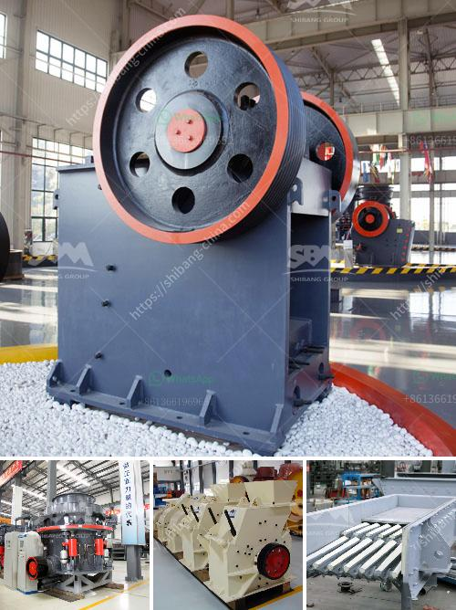

<h3>how much cost to build a 50 ton cement plant</h3>
The construction and operation of a cement plant is a complex and capital-intensive undertaking. From acquiring the necessary permits to procuring machinery and hiring skilled labor, numerous factors contribute to the overall cost of building a cement plant. In this article, we will explore the key components and estimated costs required to build a 50-ton cement plant.

One of the initial expenses is acquiring suitable land for the cement plant. The location should not only ensure accessibility but also comply with environmental regulations. Costs may vary depending on the proximity to raw material sources and infrastructure. Permitting costs involve obtaining various licenses and compliances with local authorities and can vary widely based on project-specific requirements.

Cement production necessitates the availability of raw materials such as limestone, clay, iron ore, and gypsum. The cost of mining or sourcing these materials depends on their availability and proximity to the plant site. Extracting raw materials and further processing them to obtain quality cement clinker can account for a significant portion of the overall cost.

A cement plant requires a range of machinery and equipment for various stages of production, from raw material crushing and grinding to packing and distribution. Major equipment includes crushers, mills, kilns, preheaters, clinker coolers, and cement mills. The cost of machinery can vary widely based on their capacity, specifications, and brand reputation. Additionally, installation and commissioning expenses should be considered.

Operating a cement plant necessitates skilled and semi-skilled labor for various operations such as production, maintenance, and quality control. Labor costs include wages, benefits, insurance, and training expenses. The workforce size will depend on the scale of production and automation levels. Hiring and retaining skilled personnel play a crucial role in plant efficiency and overall costs.

Cement plants require supporting infrastructure including roads, electricity supply, water availability, and waste management systems. The cost of building or upgrading infrastructure, such as constructing roads, power transmission lines, and water treatment plants, should be included in the overall cost estimation. Additionally, ongoing utility costs will contribute to the operational expenses.

Cement plants need to adhere to environmental regulations and invest in pollution control measures. These measures might involve treatment systems, dust collection equipment, and monitoring devices to minimize emissions and ensure compliance. The cost of implementing such measures can vary depending on local regulations and the plant's environmental impact assessment.

The cost of building a 50-ton cement plant is a multifaceted endeavor, with various components contributing to the overall expenditure. Therefore, providing an exact figure is challenging. Factors like location, raw material availability, machinery selection, labor costs, infrastructure, and environmental compliance, among others, impact the total investment required. Engaging professionals in the construction industry and conducting detailed feasibility studies can help in accurately estimating the costs while ensuring a successful cement plant project.
<h3>Contact us</h3><ul><li><strong>Whatsapp:&nbsp;<a href="https://wa.me/8613661969651">+8613661969651</a></strong></li><li><a href="https://swt.shibang-china.com/?git&amp;zhl&amp;how much cost to build a 50 ton cement plant"><strong>Online Service(chat now)</strong></a></li></ul><h3>Related</h3><ul><li><a href='crusher plant for sale in pakistan.md'>crusher plant for sale in pakistan</a></li><li><a href='river stone crusher.md'>river stone crusher</a></li><li><a href='industrial ball mill.md'>industrial ball mill</a></li><li><a href='stone crusher uganda.md'>stone crusher uganda</a></li><li><a href='high efficiency manganese ore raymond mill in india.md'>high efficiency manganese ore raymond mill in india</a></li></ul>