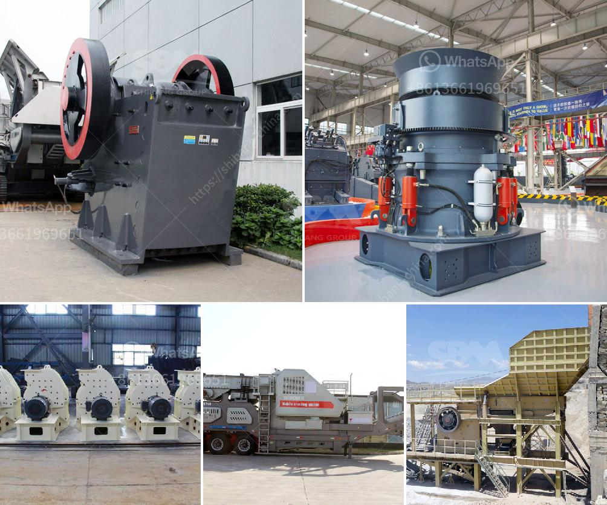

<h3>how much cost to establish stone crusher south africa</h3>
The stone crusher industry in South Africa is considered to be one of the booming industries in the continent. With the country’s strong infrastructure, it has paved the way for many businesses to thrive in its growing economy. However, despite its popularity, there are still some factors that potential entrepreneurs need to consider in order to successfully establish a stone crusher in South Africa.

The first and foremost factor is the cost involved in setting up the crusher. Initial costs for a stone crusher in South Africa can vary greatly depending on the size, magnitude, and nature of the project. Beyond that, a real estate investment for commercial purposes is likely to involve a substantial investment. Land plots or commercial spaces available in sought-after locations can be expensive. Moreover, there may be additional financial implications such as obtaining licenses and permits from local authorities, conducting environmental impact assessments, and complying with regulations.

The next major expense is the procurement of the necessary equipment and machinery. A stone crusher requires machinery that functions efficiently, ensuring a steady output of high-quality materials such as crushed stones. These machines need to be bought, rented, or leased, which adds to the initial investment. Additionally, maintenance costs and spare parts also need to be taken into consideration in the long run.

Furthermore, labor costs need to be assessed. Operating a stone crusher requires a dedicated workforce that understands the intricacies of the machine and effectively manages its operations. Hiring skilled and experienced individuals may have a higher cost but will ensure smooth operation and minimize downtime. Adequate training programs may also be required for new employees, which would further add to the costs.

In addition to the establishment cost, it is essential to consider the ongoing expenses required to sustain the stone crusher business in the long run. These include the cost of raw materials, such as stones and aggregates, which need to be sourced regularly. Fuel and electricity costs for operating the machines and transportation costs for delivering the crushed stones to customers should also be part of the budget.

Finally, marketing and advertising costs play a crucial role in establishing a successful stone crusher in South Africa. Creating awareness about the company’s products and services is essential for attracting potential customers. Proper marketing strategies, both online and offline, may involve additional expenses that should not be overlooked.

In conclusion, establishing a stone crusher in South Africa requires a substantial investment and careful planning. The costs involved go beyond the initial acquisition of the machinery and land. It also includes ongoing expenses such as sourcing raw materials, labor costs, and marketing efforts. However, with proper budgeting and management, a stone crusher business can be a profitable venture in South Africa, contributing to the country's economic growth.
<h3>Contact us</h3><ul><li><strong>Whatsapp:&nbsp;<a href="https://wa.me/8613661969651">+8613661969651</a></strong></li><li><a href="https://swt.shibang-china.com/?git&amp;zhl&amp;how much cost to establish stone crusher south africa"><strong>Online Service(chat now)</strong></a></li></ul><h3>Related</h3><ul><li><a href='price of granite crusher tons per hour.md'>price of granite crusher tons per hour</a></li><li><a href='sand dryer for sale in zimbabwe.md'>sand dryer for sale in zimbabwe</a></li><li><a href='crushers double toggle.md'>crushers double toggle</a></li><li><a href='grinding mill machine gebraucht.md'>grinding mill machine gebraucht</a></li><li><a href='list of major equipments in setting up a quarry business.md'>list of major equipments in setting up a quarry business</a></li></ul>