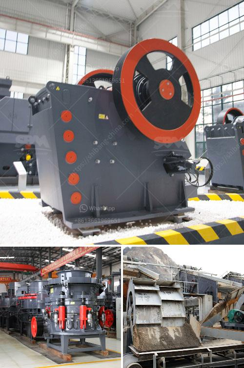

<h3>how much investment in bauxite crushing plant</h3>
Bauxite, a rock primarily comprised of aluminum hydroxide minerals, is the primary source of aluminum production. With increasing demand for this versatile metal across various industries, setting up a bauxite crushing plant holds immense potential for investors.

Aluminum, a lightweight and corrosion-resistant metal, has found extensive applications in construction, automotive, aerospace, packaging, and other sectors. Bauxite, the primary source of aluminum, is abundant in various regions across the globe. Countries like Australia, Guinea, Brazil, China, and India house significant bauxite reserves and are consequently leading global producers.

Investing in a bauxite crushing plant, which crushes the raw bauxite into smaller sizes, enables downstream processing for the extraction of aluminum. While the mining and processing of bauxite usually require large-scale, expensive machinery, the crushing plant eliminates the need for additional costs, reducing overhead expenses, and ultimately, increasing overall profit margins.

The global aluminum industry has witnessed remarkable growth, primarily driven by an increasing demand for lightweight, fuel-efficient vehicles and sustainable packaging. With aluminum being a key component in these industries, the market demand for bauxite is set to skyrocket in the coming years.

Investing in a bauxite crushing plant is a strategic move for several reasons. Firstly, high-quality bauxite reserves are dwindling, triggering concerns about the future supply chain. By securing their own supply of bauxite, investors can safeguard against price volatility and ensure a steady supply of raw materials for aluminum production.

Moreover, the process of crushing bauxite offers additional business opportunities beyond aluminum extraction. The crushed bauxite can be used in cement production, ceramics, refractories, and other industrial applications, opening up avenues to diversify the revenue streams.

With the global aluminum industry poised for significant growth, investing in a bauxite crushing plant is a wise choice for astute investors. By capitalizing on this opportunity, they can not only secure a steady supply of crucial raw materials but also tap into various other industries, maximizing profitability in the long run.
<h3>Contact us</h3><ul><li><strong>Whatsapp:&nbsp;<a href="https://wa.me/8613661969651">+8613661969651</a></strong></li><li><a href="https://swt.shibang-china.com/?git&amp;zhl&amp;how much investment in bauxite crushing plant"><strong>Online Service(chat now)</strong></a></li></ul><h3>Related</h3><ul><li><a href='cost of jaw crusher in kenya.md'>cost of jaw crusher in kenya</a></li><li><a href='quarry causer machine.md'>quarry causer machine</a></li><li><a href='density of crushed hornfels basalt granite.md'>density of crushed hornfels basalt granite</a></li><li><a href='how much cost to establish stone crusher south africa.md'>how much cost to establish stone crusher south africa</a></li><li><a href='business plan for clinker grinding plant.md'>business plan for clinker grinding plant</a></li></ul>