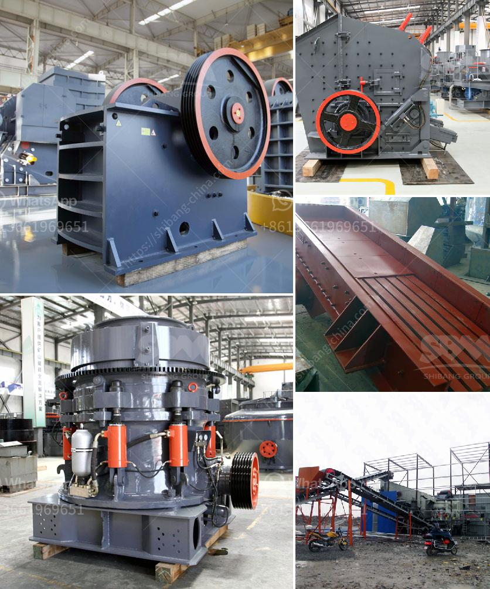

<h3>how to build a gold wash plant</h3>
A gold wash plant is a crucial piece of equipment for gold mining enthusiasts. No matter the scale or location of their operation, miners need to ensure their wash plant is built with efficiency, simplicity, and robustness in mind to maximize gold recovery. The planning and preparation involved in successfully building a wash plant require ample research, engineering expertise, and a holistic approach.

Before starting the construction process of a gold wash plant, assess your mining needs and available resources. Consider aspects such as gold recovery rate, budget, water availability, and the space you have for the plant. Having a clear understanding of these requirements will guide your entire building process effectively.

Perform thorough research on the different types and designs of gold wash plants available in the market or through online resources. Pay attention to factors such as the trommel size, hopper capacity, water spray bars, and mobility. Based on your requirements, design the blueprint for your wash plant accordingly.

Once you finalize the design, start gathering the necessary materials and components for building your gold wash plant. Essential items might include a trommel screen, sluice box, water pump, generator, and various hoses and fittings. Consider sourcing high-quality materials that can withstand the demands of your mining operation for durability and efficiency.

Begin the construction process by assembling the various components of your gold wash plant. Follow the design blueprint meticulously, ensuring all connections and mechanisms are securely fastened. It is essential to pay attention to detail during this phase to guarantee the smooth operation of the plant once it is complete.

With the initial assembly completed, run tests to assess the functionality, efficiency, and gold recovery rate of your wash plant. Make necessary adjustments and fine-tune the different components until you achieve optimal results. Regular testing and evaluation will help identify any issues and improve the overall performance of your wash plant.

Building a gold wash plant requires meticulous planning, resource gathering, and proper execution. It is essential to prioritize factors like gold recovery rate, budget, and available space to construct an efficient and robust wash plant. By following these steps and continuously testing and refining your plant, you will increase the chances of successfully recovering gold in your mining operation.
<h3>Contact us</h3><ul><li><strong>Whatsapp:&nbsp;<a href="https://wa.me/8613661969651">+8613661969651</a></strong></li><li><a href="https://swt.shibang-china.com/?git&amp;zhl&amp;how to build a gold wash plant"><strong>Online Service(chat now)</strong></a></li></ul><h3>Related</h3><ul><li><a href='basalt mobile crusher price price.md'>basalt mobile crusher price price</a></li><li><a href='iron ore mobile crusher.md'>iron ore mobile crusher</a></li><li><a href='equipment for dimension stone production.md'>equipment for dimension stone production</a></li><li><a href='stone crushers for sale south africa second hand.md'>stone crushers for sale south africa second hand</a></li><li><a href='average cost of graphite mining plant.md'>average cost of graphite mining plant</a></li></ul>