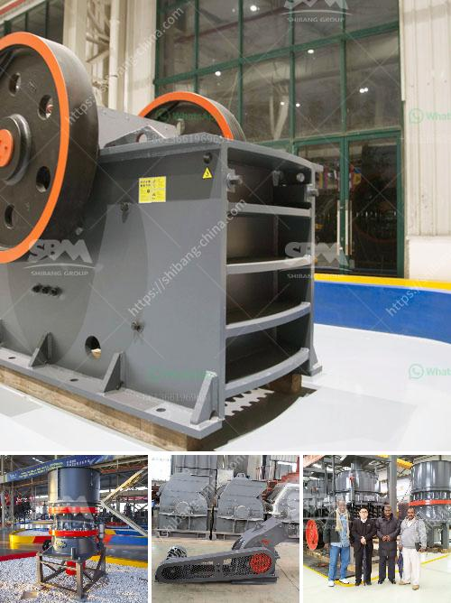

<h3>how to crush granite to powder</h3>
Granite, known for its strength and durability, is a popular choice in construction and decoration projects. But what happens when you need to crush this imposing material into a fine powder? In this article, we will explore methods for crushing granite effectively, enabling you to transform it into a powdered form for various uses.

To crush granite into powder, one can employ a few different techniques. The most common approach involves using a heavy-duty crusher to break the granite into small, manageable chunks. These chunks can then be further crushed into a finer powder using a cone crusher or an impact mill. Another method involves using a mortar and pestle to manually grind the granite. While this manual method requires a significant amount of force and time, it can be suitable for smaller quantities or when a crushing machine is not available.

Ensure you take adequate safety precautions when crushing granite, especially when using heavy machinery. Appropriate personal protective equipment, such as gloves and goggles, should be worn to shield against injury caused by flying debris. Additionally, it is advisable to secure the granite firmly during the crushing process to prevent accidents. Always follow the manufacturer's instructions and safety guidelines when operating heavy machinery.

Powdered granite finds numerous applications across industries. In architecture, it can be mixed with other materials to create unique concrete formulations, enhancing the durability and aesthetic appeal of structures. In manufacturing, finely crushed granite can be used as a filler in composite materials or as a component in the production of paints and coatings. The versatility of granite powder makes it a valuable resource in various industrial applications.

Crushing granite into a fine powder may seem like a challenging task, given its inherent strength. However, employing the right techniques and safety precautions can enable you to efficiently transform granite into a versatile powdered material. By doing so, you unlock the potential for a wide range of applications, from construction to manufacturing, and beyond.
<h3>Contact us</h3><ul><li><strong>Whatsapp:&nbsp;<a href="https://wa.me/8613661969651">+8613661969651</a></strong></li><li><a href="https://swt.shibang-china.com/?git&amp;zhl&amp;how to crush granite to powder"><strong>Online Service(chat now)</strong></a></li></ul><h3>Related</h3><ul><li><a href='dolomite crusher plant in malaysia.md'>dolomite crusher plant in malaysia</a></li><li><a href='equipment used in iron ore beneficiation.md'>equipment used in iron ore beneficiation</a></li><li><a href='china jaw crusher importer in pakistan.md'>china jaw crusher importer in pakistan</a></li><li><a href='stone crusher price in ethiopia.md'>stone crusher price in ethiopia</a></li><li><a href='crusher price in kazakhstan.md'>crusher price in kazakhstan</a></li></ul>