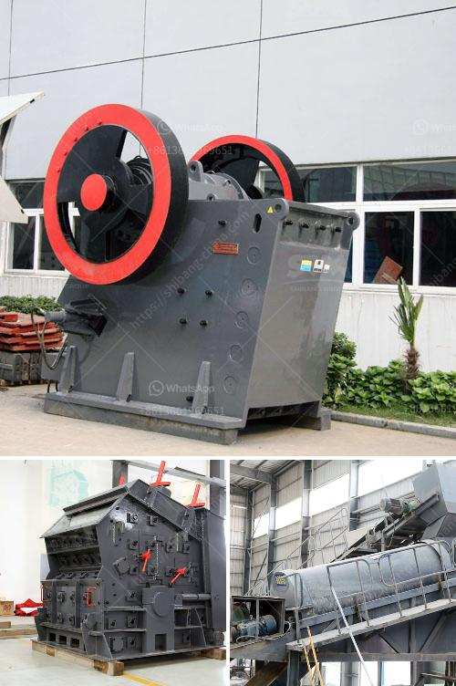

<h3>how to find startup funding for a stone crushing business</h3>
Starting a stone crushing business can be a lucrative venture if the right resources are in place. This article will outline the steps necessary to secure startup funding for a stone crushing business and turn it into a profitable enterprise.

One of the first things that will help secure startup funding is acquiring the necessary equipment. A stone crushing business requires heavy-duty machinery and tools to ensure a high level of productivity. Therefore, it is important to research and identify the equipment that will best suit the needs of the business. Once the required machinery has been identified, a comprehensive list can be prepared along with the cost of each item.

Next, it is crucial to create a well-thought-out business plan. This plan should highlight the market potential, target customer base, marketing strategies, and financial projections. A well-crafted business plan will demonstrate to potential investors or lenders that the entrepreneur has thoroughly researched the stone crushing industry and has a clear understanding of its growth potential.

Finding startup funding for a stone crushing business can be achieved through various avenues. One option is to approach traditional banking institutions and present the business plan. Banks often have specific loan programs for small businesses and may be willing to extend credit to a promising venture.

Another option is to seek out private investors or venture capital firms. These entities specialize in providing funding for startups and may be more open to taking risks than traditional banks. To attract potential investors, it is important to present a compelling business plan that showcases the profitability and growth potential of the stone crushing business.

Apart from traditional funding sources, entrepreneurs can also explore crowdfunding platforms. Crowdfunding allows individuals to contribute small amounts of money toward a business venture and can be an effective way to secure startup funding. To succeed in crowdfunding, it is important to create a compelling campaign that appeals to potential contributors and clearly outlines the benefits of supporting the stone crushing business.

In conclusion, finding startup funding for a stone crushing business requires thorough research, planning, and a well-crafted business plan. By identifying the necessary equipment, presenting a comprehensive business plan, and exploring various funding options, entrepreneurs can secure the funding needed to launch a successful stone crushing business.
<h3>Contact us</h3><ul><li><strong>Whatsapp:&nbsp;<a href="https://wa.me/8613661969651">+8613661969651</a></strong></li><li><a href="https://swt.shibang-china.com/?git&amp;zhl&amp;how to find startup funding for a stone crushing business"><strong>Online Service(chat now)</strong></a></li></ul><h3>Related</h3><ul><li><a href='equipment for dimension stone production.md'>equipment for dimension stone production</a></li><li><a href='convaer belting company in durban.md'>convaer belting company in durban</a></li><li><a href='supplier stone crusher indonesia.md'>supplier stone crusher indonesia</a></li><li><a href='ball mill in romania.md'>ball mill in romania</a></li><li><a href='iron ore cruseher plant price.md'>iron ore cruseher plant price</a></li></ul>