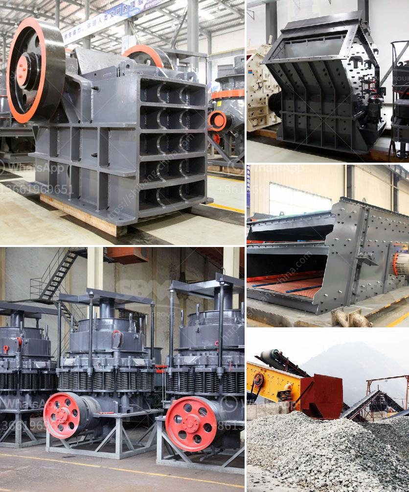

<h3>how to increase capacity of cement ball mill</h3>
Are you a cement plant owner or operator? Are you struggling with the performance of your cement ball mill? Are you looking to increase its grinding capacity and productivity? Well, look no further because this article will provide you with several practical tips on how to increase the capacity of your cement ball mill.

Firstly, it is important to understand that grinding efficiency is directly proportional to mill power. Therefore, increasing the power of the mill will also increase its grinding capacity. But how can you increase the power without impacting the quality of the final product? Here are some effective strategies:

1. Grinding media optimization: It is commonly known that grinding balls are crucial elements in the comminution process of cement plants. By optimizing the size, shape, and composition of the grinding media, you can improve the grinding efficiency and consequently increase the mill's capacity. For example, using high chrome balls instead of low chrome ones will increase the mill's power and grinding capacity.

2. Feed size optimization: Another way to increase the grinding capacity is to optimize the feed size distribution. By reducing the top size of the incoming material, you can increase the feed rate to the mill and consequently enhance its grinding efficiency. Additionally, controlling the feed size distribution can minimize the presence of oversized particles, which can negatively impact the mill's performance.

3. Mill internals inspection: Regular inspection of the mill internals, such as liners, diaphragms, and grinding media, is essential to ensure their proper functioning. Damaged or worn-out internals can lead to a decrease in the mill's efficiency and capacity. By identifying and addressing any issues promptly, you can prevent unexpected downtime and optimize the mill's performance.

4. Mill ventilation optimization: The ventilation system plays a significant role in the mill's operation. Proper air circulation inside the mill helps remove the heat generated during grinding, maintains the proper temperature, and prevents excessive moisture accumulation. By optimizing the mill's ventilation system, you can enhance the mill's capacity and improve its performance.

5. Circulating load optimization: The circulating load in a cement ball mill is a measure of the efficiency of the grinding process. It accounts for a significant portion of the mill's power consumption and can impact the mill's performance. By manipulating the circulating load, you can control the mill's operation and increase its grinding capacity.

6. Modernization and automation: Investing in modernization and automation technologies can significantly improve the mill's performance and capacity. Upgrading your mill's control system, for example, can provide better process control and optimize various parameters such as feed rate, rotation speed, and grinding pressure. Additionally, automation systems can ensure continuous monitoring and adjustment, resulting in more stable and efficient operation.

These strategies are just a few examples of how you can increase the capacity of your cement ball mill. It is important to note that every mill is unique, and different factors may influence its capacity. Consulting with experts in the field and conducting a thorough evaluation of your mill's performance can provide valuable insights and help you develop a tailored plan to optimize your mill's capacity.
<h3>Contact us</h3><ul><li><strong>Whatsapp:&nbsp;<a href="https://wa.me/8613661969651">+8613661969651</a></strong></li><li><a href="https://swt.shibang-china.com/?git&amp;zhl&amp;how to increase capacity of cement ball mill"><strong>Online Service(chat now)</strong></a></li></ul><h3>Related</h3><ul><li><a href='how to make a roller mill.md'>how to make a roller mill</a></li><li><a href='andhra pradesh coal crusher equipment price.md'>andhra pradesh coal crusher equipment price</a></li><li><a href='price of mini cement plant india.md'>price of mini cement plant india</a></li><li><a href='roll crusher used equipment.md'>roll crusher used equipment</a></li><li><a href='gypsum granules plant manufacturer in india.md'>gypsum granules plant manufacturer in india</a></li></ul>