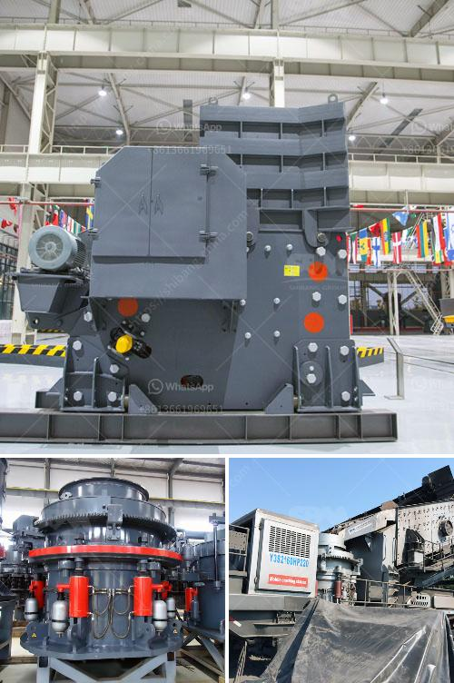

<h3>how to make a roller mill</h3>
A roller mill is a tool used in the agricultural and industrial sectors to process grain and other raw materials. It functions by passing these materials between a series of rotating rollers, thus crushing or grinding them into smaller particles. While roller mills are readily available in the market, building your own can prove to be a rewarding and cost-effective project. In this article, we will guide you through the process of constructing a roller mill.

Sketch out a detailed plan for your roller mill, including precise measurements, roller spacing, and any additional features you may want to add. This design will serve as your blueprint throughout the construction process.

- Using the steel or iron sheets, cut them according to your measurements, ensuring that you have the necessary number of sheets for the desired height of the roller mill.

- Weld the vertical seams of the sheets together using your welding equipment. Ensure the seams are sturdy and secure to support the weight and pressure exerted during operation.

- Attach the metal brackets to reinforce the corners of the frame, providing added stability. Weld them in place at each corner.

- Using the marker pen and measuring tape, indicate the precise location for each rod on the steel plate.

- Weld the rods firmly into place, ensuring they are perpendicular to the surface of the plate. This will allow for smooth rotation and efficient processing of materials.

- Test your roller mill by adding a small amount of grain or other raw materials to assess its performance. Ensure that the materials are being crushed or ground effectively and that the desired particle size is achieved.

Building your own roller mill can be a fulfilling and cost-effective DIY project, providing you with a practical tool to process grain and other raw materials. By following these steps and taking necessary safety precautions, you can construct a robust roller mill that meets your specific requirements.

Remember, when handling welding equipment and materials, always prioritize safety by wearing proper protective gear and operating equipment in a well-ventilated and controlled environment. With patience and attention to detail, your homemade roller mill will be a valuable addition to your workshop or agricultural operation.
<h3>Contact us</h3><ul><li><strong>Whatsapp:&nbsp;<a href="https://wa.me/8613661969651">+8613661969651</a></strong></li><li><a href="https://swt.shibang-china.com/?git&amp;zhl&amp;how to make a roller mill"><strong>Online Service(chat now)</strong></a></li></ul><h3>Related</h3><ul><li><a href='portable crushing machine from spain.md'>portable crushing machine from spain</a></li><li><a href='crusher run for sale in sabah.md'>crusher run for sale in sabah</a></li><li><a href='stone crusher price list.md'>stone crusher price list</a></li><li><a href='ball mill manufacturers in pune.md'>ball mill manufacturers in pune</a></li><li><a href='turkey crusher company.md'>turkey crusher company</a></li></ul>