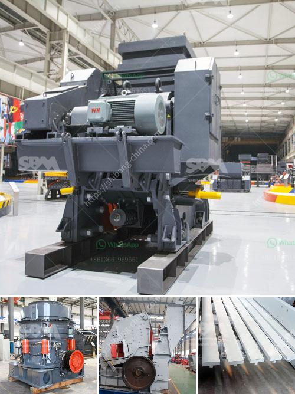

<h3>how to make a vibrating screen</h3>
A vibrating screen is a useful tool in the sorting and grading of various materials in mining, construction, agriculture, and other industries. For a vibrating screen to work efficiently, it must be properly installed and maintained. Here's how you can make one:

To begin, you will need to gather the necessary materials, including a metal frame, screen mesh, springs, nuts and bolts, eccentric shaft, and an electric motor. You can purchase these items from a local hardware store or online supplier.

Next, construct a sturdy metal frame using the dimensions suitable for your specific application. Ensure that the frame is strong and welded securely to provide stability during operation.

Attach the screen mesh to the frame using bolts and nuts. The screen mesh should have the appropriate number of layers and openings to efficiently separate and grade the desired materials. It is crucial to use high-quality screen mesh that can withstand wear and tear.

Next, install the springs onto the frame. The springs will provide the necessary vibration and movement to the screen. Ensure that the springs are evenly distributed across the frame and are properly attached to avoid uneven vibrations.

Mount the eccentric shaft onto the frame. The eccentric shaft is responsible for creating the circular motion that allows the materials to be separated. It is crucial to align the eccentric shaft properly and secure it tightly to the frame.

Finally, attach an electric motor to the frame to provide the necessary power for the vibrating screen. Make sure the motor is compatible with the required voltage and has the appropriate horsepower for your application.

Once you have successfully assembled your vibrating screen, regularly inspect and maintain it to ensure optimal performance. Routine checks for wear and tear, lubrication, and tightening of bolts and nuts are essential to prolong its lifespan. 

In conclusion, constructing a vibrating screen requires careful planning and attention to detail. By following the steps mentioned above, you can build a reliable vibrating screen that will effectively sort and grade various materials for your specific needs.
<h3>Contact us</h3><ul><li><strong>Whatsapp:&nbsp;<a href="https://wa.me/8613661969651">+8613661969651</a></strong></li><li><a href="https://swt.shibang-china.com/?git&amp;zhl&amp;how to make a vibrating screen"><strong>Online Service(chat now)</strong></a></li></ul><h3>Related</h3><ul><li><a href='pakistan copper crusher processing comoanies.md'>pakistan copper crusher processing comoanies</a></li><li><a href='project proposal on stone crushing mill small scale.md'>project proposal on stone crushing mill small scale</a></li><li><a href='german hammer mill ceramic.md'>german hammer mill ceramic</a></li><li><a href='cone crusher in china cone.md'>cone crusher in china cone</a></li><li><a href='3 raymond roller mill.md'>3 raymond roller mill</a></li></ul>