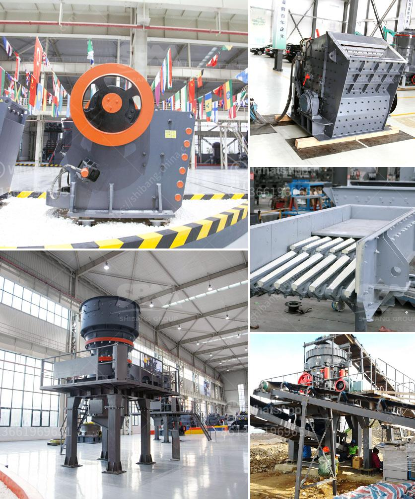

<h3>how to make ball mill pdf</h3>
A ball mill is a cylindrical machine designed to grind various materials into fine powders. These machines are often used in chemistry, metallurgy, mining, and other related industries. Typically, a ball mill consists of a cylinder filled with grinding balls, constructed from various materials such as steel, ceramic, or rubber. In this article, we will demonstrate how to build a simple, yet efficient ball mill that can easily be modified to suit other purposes.

- A suitable cylindrical container, such as a PVC pipe (approximately 20 centimeters in diameter and 40 centimeters in length)

Drill a hole with a diameter slightly smaller than the outer diameter of the motor shaft in the center of the pipe cap. Slide the motor shaft through the hole; secure the motor to the cap using nuts, washers, and bolts. Place the PVC pipe on the base, and secure it firmly to the cap.

Cut open the PVC pipe longitudinally, leaving approximately 1/3 of the pipe uncut. This uncut portion will act as the hinge, allowing the chamber to be easily opened and closed. Additionally, drill holes near the top of the chamber to allow for ventilation. Attach the external support frame (if desired) to ensure stability during operation. Finally, attach the variable speed controller (if available) to the motor to allow precise control over the milling process.

Add a few evenly distributed small screws inside the chamber to act as projection points for the grinding balls. Place approximately half of the desired grinding ball volume in the chamber.

Close the chamber and secure it with a clamp. Connect the power source to the motor and turn it on. Adjust the speed accordingly, allowing the balls to rotate inside the chamber, effectively grinding the desired material. Be cautious when using the ball mill and follow all safety instructions to avoid accidents.

By following these simple steps, you can build a basic ball mill at home for various grinding purposes. Although it is a simple machine, the ball mill can be incredibly useful in various applications, including chemistry experiments, mineral grinding, and even for making fireworks. Remember to always prioritize safety and wear protective gear while operating the mill. Happy grinding!
<h3>Contact us</h3><ul><li><strong>Whatsapp:&nbsp;<a href="https://wa.me/8613661969651">+8613661969651</a></strong></li><li><a href="https://swt.shibang-china.com/?git&amp;zhl&amp;how to make ball mill pdf"><strong>Online Service(chat now)</strong></a></li></ul><h3>Related</h3><ul><li><a href='sand washing plant price.md'>sand washing plant price</a></li><li><a href='vsi crusher plant.md'>vsi crusher plant</a></li><li><a href='low speed crusher suppliers in china.md'>low speed crusher suppliers in china</a></li><li><a href='coal pulverisers machines.md'>coal pulverisers machines</a></li><li><a href='track crushing plant.md'>track crushing plant</a></li></ul>