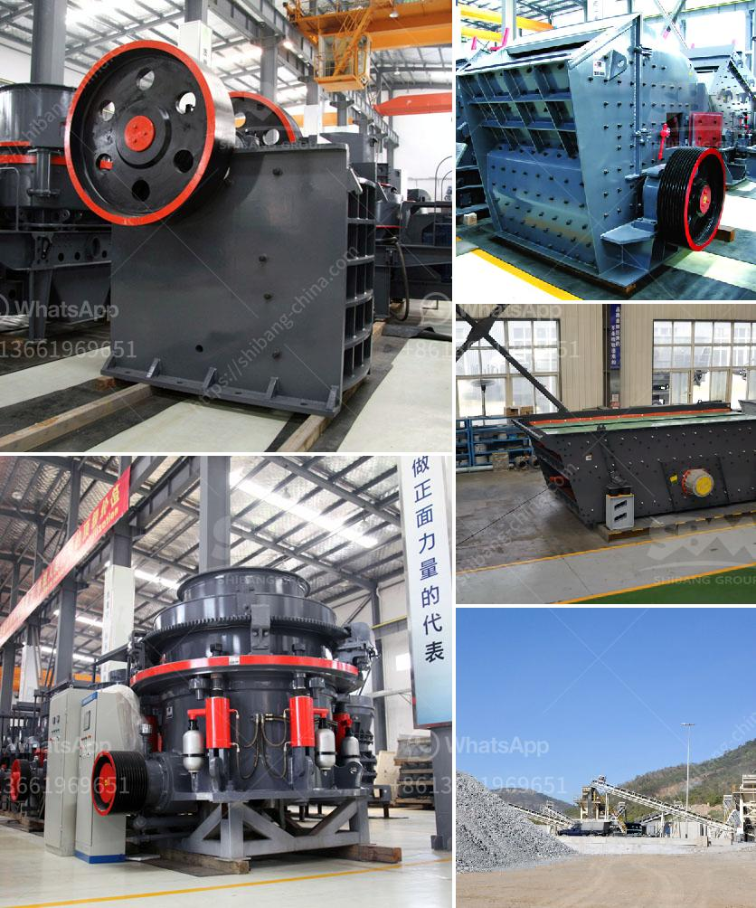

<h3>how to make copper concentrate</h3>
Copper concentrate is a valuable raw material that is widely used in various industries, including construction, electrical, and automotive. It is obtained by processing copper ore through a series of steps that involve crushing, grinding, froth flotation, and other conventional methods. In this article, we will guide you through the process of making copper concentrate, highlighting the key steps involved.

The first step in the process is to mine the copper ore. This is usually done in large open-pit mines or underground mines, depending on the location and accessibility of the ore deposit. The copper ore is typically extracted using explosives, and heavy machinery such as drills, trucks, and shovels.

Once the copper ore is extracted, it is then crushed and ground into a fine powder. This increases the surface area of the ore, making it easier for the subsequent steps to extract the copper minerals. Crushers and ball mills are commonly used for this purpose.

Froth flotation is a crucial step in the copper concentrate production process. In this step, the finely ground copper ore is mixed with water and specific chemicals, known as collectors and frothers. These chemicals attach to the copper minerals, rendering them hydrophobic (i.e., repelling water) while allowing the other minerals to remain hydrophilic (i.e., attracting water).

The mixture is then agitated in flotation cells, where air is bubbled through the slurry. The hydrophobic copper minerals attach to the air bubbles, rise to the surface, and form a froth layer. This froth, which contains the copper concentrate, is skimmed off and collected.

After the froth flotation stage, the collected copper concentrate is typically dewatered to remove excess water. This is done using thickeners or filters, which separate the solid concentrate from the liquid. The resulting product is a concentrated copper slurry.

To further reduce the moisture content, the copper slurry is then dried. This is typically achieved through either rotary dryers or flash dryers, which heat the concentrate to remove any remaining water. The final product obtained is copper concentrate, which usually contains around 30% to 40% copper, depending on the ore grade and processing efficiency.

Finally, the copper concentrate is sent to smelters, where it is further processed to obtain pure copper metal. The concentrate is usually heated in a furnace, along with fluxes and other additives, to remove impurities and convert the copper minerals into a molten state.

The molten copper is then cast into ingots or further processed to produce copper cathodes or other copper products, depending on the specific requirements of the end-users.

In conclusion, the production of copper concentrate involves several essential steps, starting from the mining of copper ore to the production of a concentrated copper slurry. The process includes crushing, grinding, froth flotation, dewatering, drying, and finally, smelting and refining. Each step is critical in obtaining a high-quality copper concentrate that is valuable in various industrial applications.
<h3>Contact us</h3><ul><li><strong>Whatsapp:&nbsp;<a href="https://wa.me/8613661969651">+8613661969651</a></strong></li><li><a href="https://swt.shibang-china.com/?git&amp;zhl&amp;how to make copper concentrate"><strong>Online Service(chat now)</strong></a></li></ul><h3>Related</h3><ul><li><a href='jaw crusher structure.md'>jaw crusher structure</a></li><li><a href='basalt mobile crusher price price.md'>basalt mobile crusher price price</a></li><li><a href='cement grinding machinery europe.md'>cement grinding machinery europe</a></li><li><a href='coal pulverisers machines.md'>coal pulverisers machines</a></li><li><a href='mobile crushers qatar.md'>mobile crushers qatar</a></li></ul>