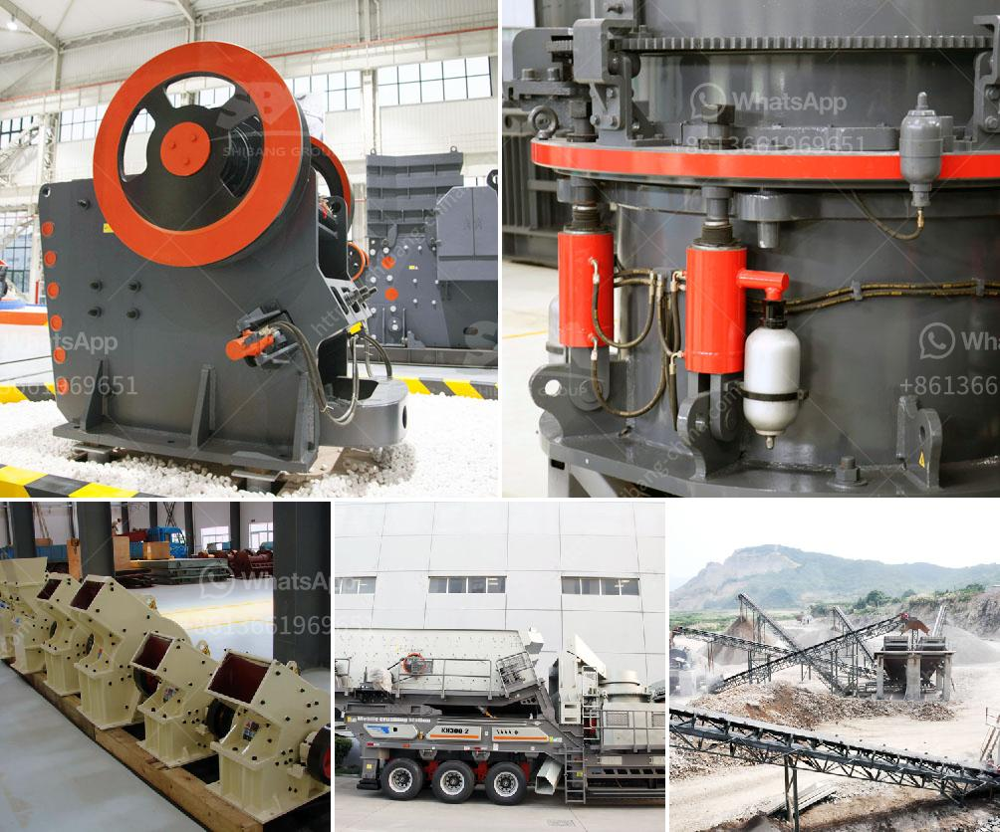

<h3>how to make industrial talcum powder</h3>
Industrial talcum powder plays a crucial role in various manufacturing industries, including cosmetics, pharmaceuticals, ceramics, plastics, and more. Also known as industrial talc, this versatile mineral powder is widely used for its lubricating, anti-sticking, and absorbent properties. In this article, we will explore the manufacturing process of industrial talcum powder.

The first step in making industrial talcum powder is the extraction of talc ore from deposits. Talc deposits are usually found near metamorphic rocks, which are rich in minerals such as magnesite, dolomite, and serpentine. These rocks are mined using traditional methods such as open-pit mining, underground mining, or block caving.

After the extraction, the talc ore undergoes sorting to separate the talc-bearing rocks from other impurities. This process ensures that the talc extracted is of high quality. Once sorted, the rocks are crushed into smaller pieces using machinery to facilitate further processing.

The crushed talc rocks are milled into a fine powder through a process known as milling. Various types of mills, including ball mills, jet mills, and roller mills, are used for this purpose. The choice of mill depends on the desired particle size and other physical properties of the powder.

Grinding is the next step in the process, where the milled talc powder undergoes further size reduction. This process increases the surface area of the talc particles, improving their properties and enhancing their performance in industrial applications.

To meet strict quality standards, the milled and ground talcum powder is subjected to purification processes. These processes usually involve removing impurities, such as heavy metals, organic compounds, and other mineral contaminants that may be present in the ore. Purification ensures the safety and high quality of the final industrial talcum powder.

Once the purification process is complete, the purified talcum powder is dried to remove any residual moisture. This is done to prevent clumping and to improve its shelf life. The drying process typically includes using industrial dryers or kilns at controlled temperatures.

After drying, the talcum powder is ready for packaging. It is essential to ensure that the packaging materials are clean, safe, and of high quality to maintain the integrity of the powder. Properly labeled packaging also helps in identifying the specific characteristics and intended use of the talcum powder.

The manufacturing process of industrial talcum powder involves several important steps that ensure the production of a high-quality product. Extraction and sorting of talc ore, followed by milling, grinding, purification, drying, and packaging, are critical in achieving desired particle sizes and properties. Talcum powder's versatility and widespread use in various industries confirm its importance in many manufacturing processes, attesting to its value as an essential industrial mineral.
<h3>Contact us</h3><ul><li><strong>Whatsapp:&nbsp;<a href="https://wa.me/8613661969651">+8613661969651</a></strong></li><li><a href="https://swt.shibang-china.com/?git&amp;zhl&amp;how to make industrial talcum powder"><strong>Online Service(chat now)</strong></a></li></ul><h3>Related</h3><ul><li><a href='brick crusher line production.md'>brick crusher line production</a></li><li><a href='cement clinker grinding and packing plant.md'>cement clinker grinding and packing plant</a></li><li><a href='grinding mill manufacturers.md'>grinding mill manufacturers</a></li><li><a href='stone crushing machines in canada.md'>stone crushing machines in canada</a></li><li><a href='pe 500 750 jaw crusher price.md'>pe 500 750 jaw crusher price</a></li></ul>