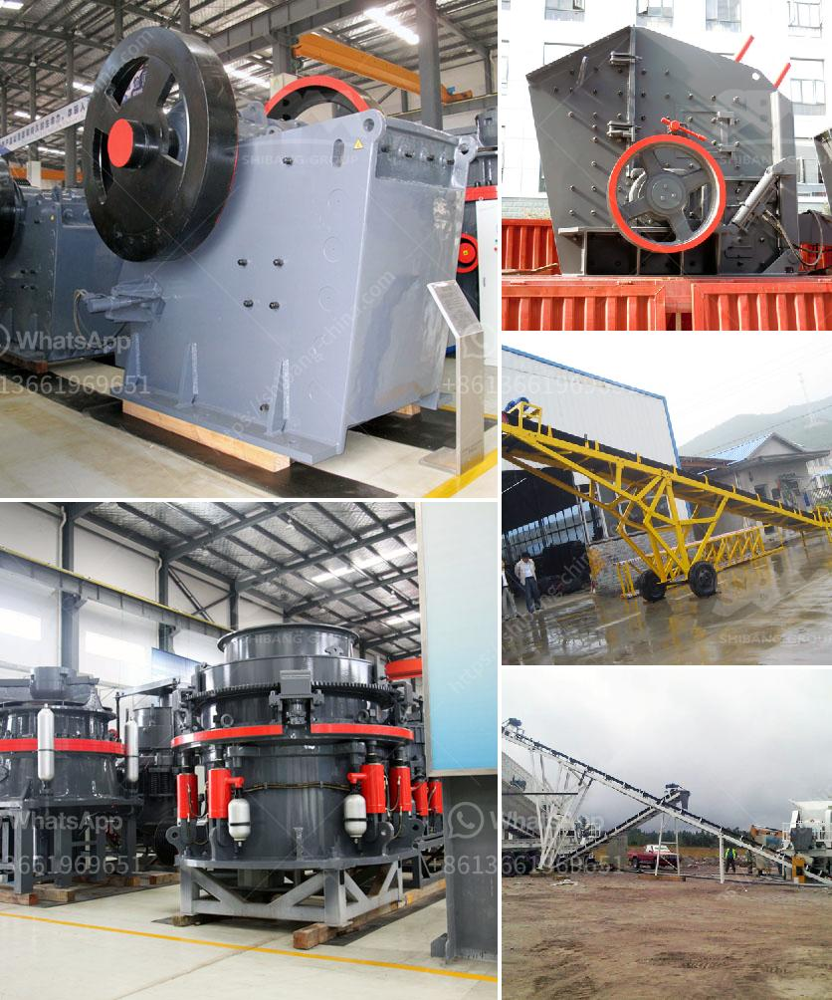

<h3>how to manufacture jaw crusher</h3>
Jaw crushers are widely used in various industries, including mining, construction, and recycling due to their ability to crush hard materials and ease of operation. If you are interested in manufacturing jaw crushers or want to understand the process behind this robust machine, this article will guide you step-by-step.

Developing a jaw crusher begins with extensive research and development. Engineers analyze various factors like size, capacity, output, and efficiency. They also explore different crushing mechanisms and jaw profiles to ensure the crusher meets the requirements of the industry and functions optimally.

Once the R&D stage is complete, the engineers move on to design and engineering. They create 2D and 3D models using computer-aided design (CAD) software to conceptualize the overall structure, internal components, and the crushing mechanism. The focus is on ensuring the crusher's durability, reliability, and ease of maintenance.

Choosing the right materials is crucial for manufacturing a jaw crusher. The main components, such as the frame, movable jaw, and swing jaw, need to be strong and resistant to excessive wear and tear. High-quality steel alloys are commonly used for these parts due to their excellent strength and durability.

Fabrication involves cutting, shaping, and assembling the different components of the jaw crusher. Computer numerical control (CNC) machines are often used for precise cutting and shaping. Experienced technicians handle this stage to ensure accurate dimensions and proper alignment, as any slight errors can impact the crusher's functionality.

The assembly of a jaw crusher is a complex process that involves fitting various components together. Technicians follow detailed assembly instructions provided by the engineering team to ensure each part is connected and fastened correctly. Hydraulic systems and electrical wiring are installed at this stage to enable smooth operation and control of the crusher.

Before a jaw crusher is ready to be shipped, it must undergo rigorous testing and quality control measures. The crusher is put through different scenarios to verify its performance, including testing various types of material, adjusting the crushing settings, and examining the wear and tear on the components. This stage is crucial to identify any defects or malfunctions and ensure the crusher meets the desired specifications.

Manufacturing a jaw crusher involves an intricate process that requires extensive research, design, engineering, material selection, fabrication, assembly, and rigorous testing. It is a collaborative effort between engineers, technicians, and quality control experts to ensure the crusher meets industry standards and functions optimally. By following these steps, manufacturers can produce robust jaw crushers that excel in crushing hard materials and offer reliability to their customers.
<h3>Contact us</h3><ul><li><strong>Whatsapp:&nbsp;<a href="https://wa.me/8613661969651">+8613661969651</a></strong></li><li><a href="https://swt.shibang-china.com/?git&amp;zhl&amp;how to manufacture jaw crusher"><strong>Online Service(chat now)</strong></a></li></ul><h3>Related</h3><ul><li><a href='gypsum recycling machines for sale.md'>gypsum recycling machines for sale</a></li><li><a href='stone crushers kenya.md'>stone crushers kenya</a></li><li><a href='bentonite production plant machinery.md'>bentonite production plant machinery</a></li><li><a href='conveyor belts for sale philippines.md'>conveyor belts for sale philippines</a></li><li><a href='clay brick crusher manufacturers in pakistan.md'>clay brick crusher manufacturers in pakistan</a></li></ul>