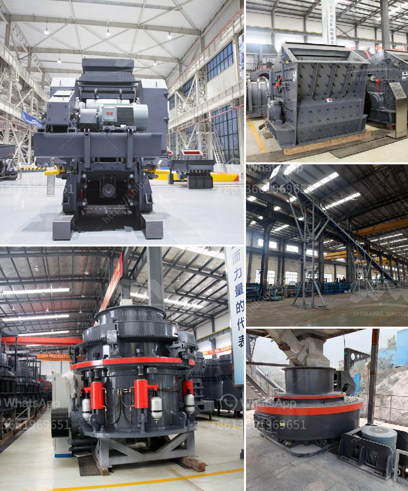

<h3>how to mine limestone small scale</h3>
Mining limestone on a small scale can be a daunting task for those not familiar with the process. A small-scale limestone mine can offer many possibilities for entrepreneurs and investors alike, but it is important to understand the challenges and potential risks involved.

Limestone, a sedimentary rock composed mainly of calcium carbonate, is commonly used in a variety of industries. It is an essential raw material for construction, agriculture, and manufacturing processes. With its wide range of applications, limestone mining can be a profitable venture for entrepreneurs looking for a sustainable business opportunity.

The first step in mining limestone on a small scale is to determine the deposit's size and location. Conducting thorough research and exploration is crucial to ensuring the viability of the mine. Engaging the help of geologists and surveyors can provide valuable insights into the quality and quantity of the limestone deposit.

Once the deposit is identified, the next step is to acquire the necessary permits and licenses required for mining operations. As regulations may vary from region to region, it is important to consult with local authorities and follow the prescribed guidelines. Compliance with environmental regulations is essential, as limestone mining can have a significant impact on the surrounding ecosystem.

To extract limestone, several methods can be employed on a small scale. Traditional manual extraction involves drilling and blasting the limestone deposit, followed by the use of heavy machinery to remove the extracted material. This method requires skilled workers and can be time-consuming, but it is cost-effective for small-scale operations.

Alternatively, a more modern approach involves the use of a mining machine, such as a surface miner or continuous miner. These machines utilize cutting tools to extract the limestone without the need for drilling and blasting. This method is more efficient and less disruptive to the surrounding environment, making it a preferred option for small-scale mining.

After limestone extraction, the material needs to be processed to meet specific industry requirements. This involves crushing and grinding the limestone into a fine powder. Depending on the application, additional processes such as calcination or hydration can be applied to produce lime or slaked lime, respectively.

Finally, the processed limestone can be sold to various industries or used in-house for projects such as construction or agriculture. Establishing a network of potential buyers or end-users is crucial for success in the small-scale limestone mining business. Building relationships with local contractors, builders, and manufacturers can ensure a steady demand for the limestone products.

Mining limestone on a small scale may come with its own set of challenges, but with the right planning and execution, it can be a profitable venture. Through thorough research, obtaining necessary permits, and employing efficient extraction and processing methods, entrepreneurs can tap into the immense potential of this valuable resource.
<h3>Contact us</h3><ul><li><strong>Whatsapp:&nbsp;<a href="https://wa.me/8613661969651">+8613661969651</a></strong></li><li><a href="https://swt.shibang-china.com/?git&amp;zhl&amp;how to mine limestone small scale"><strong>Online Service(chat now)</strong></a></li></ul><h3>Related</h3><ul><li><a href='pebbel stone crusher.md'>pebbel stone crusher</a></li><li><a href='gold washing plant for sale in south africa.md'>gold washing plant for sale in south africa</a></li><li><a href='ball mill manufacturers in bangalore machinery.md'>ball mill manufacturers in bangalore machinery</a></li><li><a href='type of crusher machine is best.md'>type of crusher machine is best</a></li><li><a href='production of rock sand.md'>production of rock sand</a></li></ul>