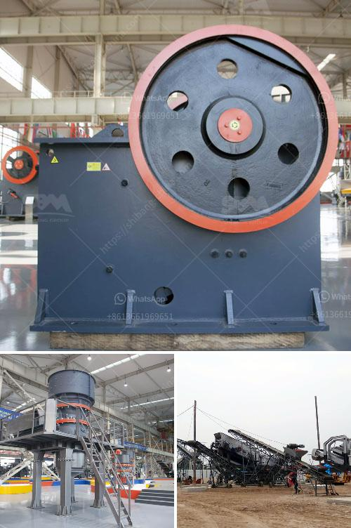

<h3>how to select machines for stone crushing plant</h3>
Selecting the right type of crushing equipment for your stone crushing plant can be incredibly difficult. However, the right machines are essential if you want your business to thrive. Therefore, you need to know everything about the machines which will help you make an informed decision. In this article, we will discuss how to select machines for a stone crushing plant.

Firstly, it is important to analyze the type of material you are working with. Different stones have different hardness levels and properties, which affect how they can be crushed. For example, a soft stone like limestone is relatively easy to crush, while granite or basalt requires more force to break apart. Understanding the characteristics of your material will help you choose the right machines that can handle the workload effectively.

Next, consider the required output size. Are you looking to produce coarse aggregates or fine aggregates? The size of the material being produced will influence the type of machine you need. For instance, a jaw crusher is suitable for coarse crushing, while a cone crusher or impact crusher is required for finer crushing.

The capacity of your crushing plant is another crucial factor to consider. The capacity needs to match the anticipated demand for the final product. If you do not have sufficient capacity, you may end up limiting your production capabilities and missing out on potential business opportunities. On the other hand, if you invest in excessive capacity, you may waste valuable resources. Therefore, having a clear understanding of your production requirements is essential for selecting the appropriate machines.

Additionally, consider the power source required for the machines. Depending on your location and energy availability, you may need to choose between machines powered by electricity or diesel. Each power source has its own advantages and limitations, so choose the one that suits your specific circumstances.

Furthermore, it is crucial to ensure that the machines you select are reliable and durable. Purchasing high-quality equipment from reputable manufacturers can save you significant costs in the long run. Inferior machines tend to break down frequently, resulting in unplanned downtime and additional expenses.

Lastly, consider the ease of maintenance and availability of spare parts for the machines. Regular maintenance is essential to keep your equipment operating at its best. Additionally, the availability of spare parts is crucial to minimize downtime in case of a breakdown. Therefore, choose machines that are easy to maintain, and where spare parts can be readily sourced.

In conclusion, selecting the right machines for your stone crushing plant involves careful consideration of factors such as the type of material, required output size, capacity, power source, reliability, and ease of maintenance. By analyzing these aspects, you can make an informed decision that will optimize your productivity and profitability in the long run. Always do thorough research and consult industry experts to ensure that you choose the most suitable machines for your specific needs.
<h3>Contact us</h3><ul><li><strong>Whatsapp:&nbsp;<a href="https://wa.me/8613661969651">+8613661969651</a></strong></li><li><a href="https://swt.shibang-china.com/?git&amp;zhl&amp;how to select machines for stone crushing plant"><strong>Online Service(chat now)</strong></a></li></ul><h3>Related</h3><ul><li><a href='china cone crusher.md'>china cone crusher</a></li><li><a href='artificial sand machine.md'>artificial sand machine</a></li><li><a href='price for sand machine.md'>price for sand machine</a></li><li><a href='grinding mill grinding mill sale.md'>grinding mill grinding mill sale</a></li><li><a href='stone crusher price list.md'>stone crusher price list</a></li></ul>