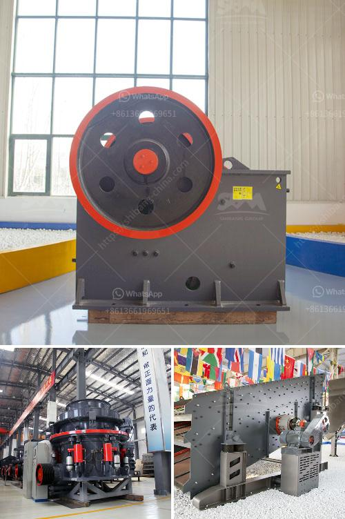

<h3>how to set up a granite quarry crusher</h3>
Granite is a highly sought-after material for both interior and exterior design applications due to its durability, aesthetic appeal, and natural beauty. With the increasing demand for granite worldwide, setting up a granite quarry crusher has become a lucrative opportunity for entrepreneurs. This article will guide you through the process of setting up a granite quarry crusher.

Before starting any business venture, it is essential to conduct thorough research and develop a comprehensive business plan. Research the market demand for granite, the competition, potential customers, and their preferences. Determine the location of your granite quarry, keeping in mind factors such as accessibility to transport routes, availability of raw materials, and proximity to target markets.

Contact the local authorities and obtain the necessary permits and licenses required to operate a quarry crusher. These permits may vary depending on your location, but typically include environmental permits, mining rights, blasting permits, and health and safety certifications. Ensure compliance with all regulations to avoid any legal hurdles.

Purchase or lease suitable land for your granite quarry crusher. The land should be clear of any legal or environmental issues that may hinder your operations. Additionally, lease or purchase necessary equipment such as excavators, dump trucks, crushers, and loaders. Ensure they are in good working condition and meet all safety standards.

Once you have acquired all the necessary equipment, it is time to set up your granite quarry crusher. Start by placing the necessary foundation stone and leveling the ground. Then, set up the primary crusher unit and secondary crushers according to the layout provided in your plan. Utilize conveyors to transport the raw materials from the quarry to the crushing units.

Prioritize safety and quality control in your operations. Implement safety measures to protect your employees and visitors, such as providing safety equipment, conducting regular safety training, and posting warning signs. Establish a quality control system to ensure that crushed granite meets the required specifications. Conduct routine testing and inspections to maintain consistent quality.

Develop a marketing strategy to promote your granite quarry crusher. Create a website, use social media platforms, and participate in industry trade shows and exhibitions to reach a broader audience. Establish partnerships with local contractors, builders, and homeowners to generate steady demand for your granite products. Explore export opportunities to expand your market reach.

Regularly assess your operations to identify areas for improvement. Monitor the performance of your equipment, implement maintenance programs, and invest in technological advancements to enhance productivity and efficiency. Seek feedback from customers and make necessary adjustments to fulfill their requirements.

In conclusion, setting up a granite quarry crusher requires careful planning, extensive research, and adherence to regulatory requirements. With thorough preparation and execution, you can establish and run a successful granite quarry crusher business that caters to the growing demand for granite in various industries.
<h3>Contact us</h3><ul><li><strong>Whatsapp:&nbsp;<a href="https://wa.me/8613661969651">+8613661969651</a></strong></li><li><a href="https://swt.shibang-china.com/?git&amp;zhl&amp;how to set up a granite quarry crusher"><strong>Online Service(chat now)</strong></a></li></ul><h3>Related</h3><ul><li><a href='feldspar quarry processing plant.md'>feldspar quarry processing plant</a></li><li><a href='sand and gravel separation machine.md'>sand and gravel separation machine</a></li><li><a href='graphite mining india.md'>graphite mining india</a></li><li><a href='river stone crusher.md'>river stone crusher</a></li><li><a href='china granite jaw crusher.md'>china granite jaw crusher</a></li></ul>