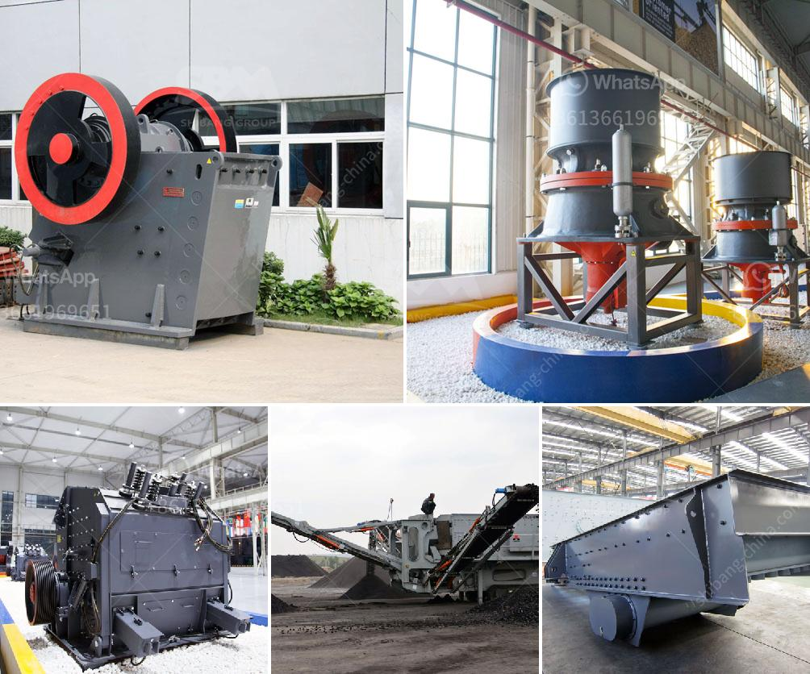

<h3>how to set up crusher</h3>
Crushers play a vital role in various industries, from mining and construction to recycling. Setting up a crusher properly is crucial to ensure its optimal performance and longevity. In this article, we will discuss a step-by-step guide on how to set up a crusher efficiently and safely, regardless of the type of crusher you have.

Choosing the right site for your crusher is essential to maximize its productivity. Look for a location with ample space, level ground, and access to necessary utilities. Clear any debris or obstacles that may hinder the setup process.

Creating a stable and solid foundation is paramount to ensure the crusher's stability. Excavate the site to the required depth, and pour a concrete base. Allow it to cure thoroughly as per the manufacturer's recommendations.

Once the foundation is ready, you can start assembling the crusher. Follow the manufacturer's instructions precisely. Each crusher will have its specific assembly instructions. Ensure all components are properly aligned, fastened, and secured.

Next, connect the crusher to a suitable power supply. Depending on the crusher model, the power requirement may vary. Use proper electrical wiring, circuit breakers, and safety switches to comply with electrical codes and prevent potential hazards.

If you have a crusher that uses a conveyor system, install it properly. Connect the conveyor belt and ensure it is correctly aligned and tensioned. Test its movement to ensure it operates smoothly without any obstructions or irregularities.

Proper lubrication is crucial for the smooth performance and longevity of your crusher. Follow the manufacturer's recommendations for the type and frequency of lubrication required. Regularly inspect and clean the crusher to avoid any build-up of debris or materials that could impact its efficiency.

Safety should always be a top priority when setting up a crusher. Install safety guards and protective devices to prevent access to moving parts. Additionally, ensure that all operators are trained in the safe operation and maintenance of the crusher. Provide adequate personal protective equipment, such as hard hats, goggles, and ear protection.

Before starting the crusher for production, conduct a thorough testing process. Make sure the crusher is functioning correctly, and all components are working harmoniously. Test the crusher with different types of materials and adjust the settings accordingly to achieve the desired output.

Properly setting up a crusher is crucial for its optimal performance, productivity, and safety. By following this step-by-step guide, you can ensure that your crusher is set up efficiently and ready to deliver the desired results. Remember, always consult the manufacturer's instructions and guidelines to achieve the best possible setup for your specific crusher model.
<h3>Contact us</h3><ul><li><strong>Whatsapp:&nbsp;<a href="https://wa.me/8613661969651">+8613661969651</a></strong></li><li><a href="https://swt.shibang-china.com/?git&amp;zhl&amp;how to set up crusher"><strong>Online Service(chat now)</strong></a></li></ul><h3>Related</h3><ul><li><a href='cone crusher manufacturers china.md'>cone crusher manufacturers china</a></li><li><a href='100tph stone crusher.md'>100tph stone crusher</a></li><li><a href='granite stone crusher india.md'>granite stone crusher india</a></li><li><a href='top 5 brands of stone crushers.md'>top 5 brands of stone crushers</a></li><li><a href='sand washing plant price.md'>sand washing plant price</a></li></ul>