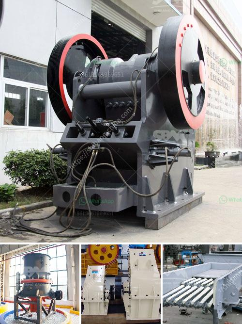

<h3>how to start stone crushing business in kenya</h3>
Stone crushing business is a profitable venture for new entrepreneurs. The demand for quality stone chips is increasing day by day. Stone products are essential for construction and infrastructure development activities. Stones are used for various purposes in construction, ranging from foundation to crushed stones that are used in the construction of roads and highways.

The growing infrastructure and construction activities in Kenya have led to a high demand for quality stones. This is the reason why many individuals and businesses are venturing into this lucrative industry.

First and foremost, it is important to identify the ideal location for your quarry. A good quarry site should have enough reserve of rocks to ensure uninterrupted supply of materials to the construction site. A stone quarry should be located away from residential areas and close to major construction sites.

To start a stone crushing business, you will need to acquire machinery like crushers, conveyors, and screens. These essential pieces of equipment are available in various sizes and capacities to meet the different production requirements of the market. Ensure that the machinery is durable, reliable, and efficient to maximize productivity.

Before starting a stone crushing business, you need to obtain all the necessary licenses and permits from the relevant authorities. These include the mining license, environmental clearance certificate, and other government approvals. Failure to comply with these regulations can lead to legal consequences and hinder the smooth operation of your business.

Creating a detailed business plan for your stone crushing business is essential. A business plan will help you identify the possible risks and challenges, and provide you with a roadmap to success. It should outline your goals, projected revenue, market analysis, and strategies to attract customers. You can seek professional help or use online resources to develop a comprehensive business plan.

After setting up your stone crushing business, it is essential to market your products to attract customers. This can be done through various marketing strategies such as advertising in local newspapers, online platforms, and collaborating with construction companies and contractors. Building a strong network and maintaining good relationships with your customers can also lead to repeat business and referrals.

Starting a stone crushing business in Kenya is a smart investment for any entrepreneur as it provides a constant source of revenue and reduces the risk of failure. However, launching this business is not an easy task, and you will need to put in a lot of effort and dedication. Remember to comply with all the legal requirements, invest in quality machinery, and develop a solid business plan to ensure your success in this competitive industry.
<h3>Contact us</h3><ul><li><strong>Whatsapp:&nbsp;<a href="https://wa.me/8613661969651">+8613661969651</a></strong></li><li><a href="https://swt.shibang-china.com/?git&amp;zhl&amp;how to start stone crushing business in kenya"><strong>Online Service(chat now)</strong></a></li></ul><h3>Related</h3><ul><li><a href='used metal crushers japan.md'>used metal crushers japan</a></li><li><a href='sand crusher for sale.md'>sand crusher for sale</a></li><li><a href='high energy ball mill india.md'>high energy ball mill india</a></li><li><a href='gypsum crusher plants in pakistan.md'>gypsum crusher plants in pakistan</a></li><li><a href='static jaw crusher and plant for sale.md'>static jaw crusher and plant for sale</a></li></ul>