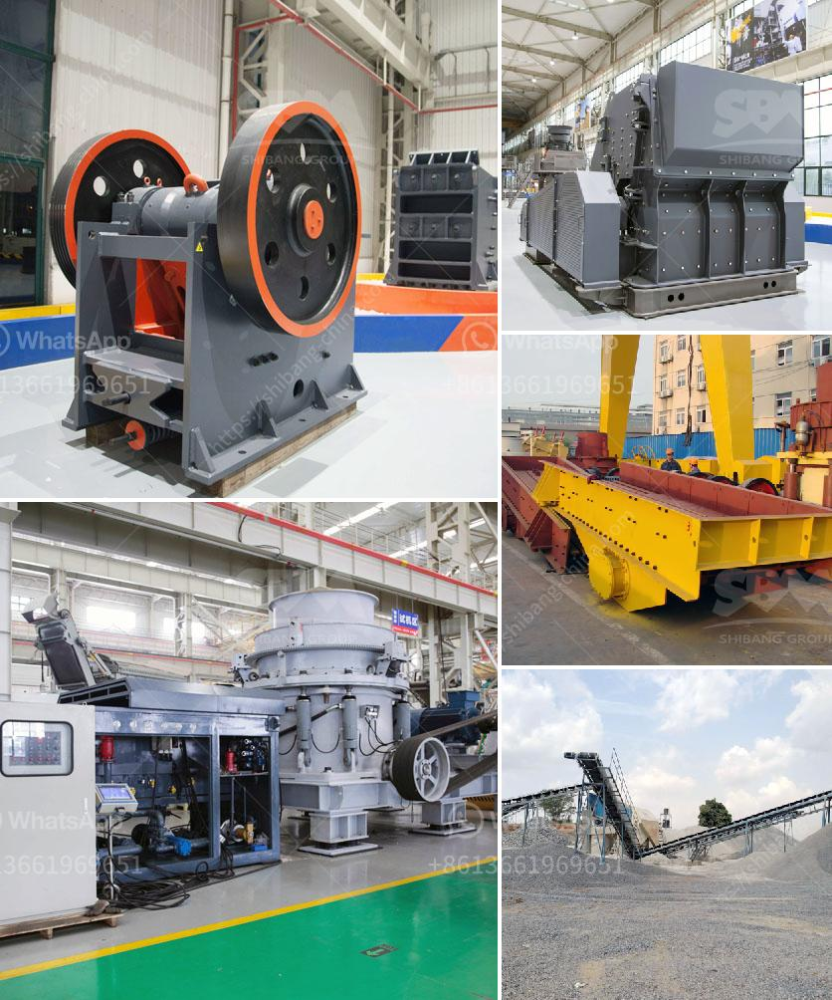

<h3>howhow to set up a stone crushing business</h3>
Starting a stone crushing business is a great idea indeed. With the increasing construction projects in the country, there has been a surge in demand for crushing equipment. This necessitates a proper set up and a well-designed business plan.

A good stone crushing business plan requires substantial investment. A detailed analysis of the available space for setting up the plant, machinery to be used, manpower required, along with their costs should be discussed in the business plan. These factors will help determine the amount of capital needed for the project.

Next, it is important to choose the right location for the stone crushing business. It is advisable to select a site where raw materials can be sourced easily, ensuring the smooth running of the business. In addition, the location should be easily accessible to construction companies and other potential customers.

Once the location is finalized, the next step is to acquire the necessary licenses and permits required to operate a stone crushing business. It is essential to comply with all the legal requirements to avoid any legal complications in the future.

After obtaining the necessary permits, the entrepreneur needs to procure the machinery and equipment required for the stone crushing business. This includes crushers, conveyors, loaders, and vibrating screens. It is advisable to engage with reliable suppliers and consider the quality and durability of the equipment before making a purchase.

Lastly, a marketing strategy should be formulated to attract customers and generate sales. This could include collaborating with construction companies, advertising in local newspapers and directories, and implementing a strong online presence through a website and social media platforms.

In conclusion, setting up a stone crushing business requires careful planning and a well-executed business plan. With the right resources and a clear focus, a stone crushing business can be a profitable venture in the long run.
<h3>Contact us</h3><ul><li><strong>Whatsapp:&nbsp;<a href="https://wa.me/8613661969651">+8613661969651</a></strong></li><li><a href="https://swt.shibang-china.com/?git&amp;zhl&amp;howhow to set up a stone crushing business"><strong>Online Service(chat now)</strong></a></li></ul><h3>Related</h3><ul><li><a href='concrete crusher made in japan.md'>concrete crusher made in japan</a></li><li><a href='jual stone crusher second jakarta.md'>jual stone crusher second jakarta</a></li><li><a href='ball mill material of construction.md'>ball mill material of construction</a></li><li><a href='conveyor belts for sale philippines.md'>conveyor belts for sale philippines</a></li><li><a href='100tph stone crushing and screening plant.md'>100tph stone crushing and screening plant</a></li></ul>