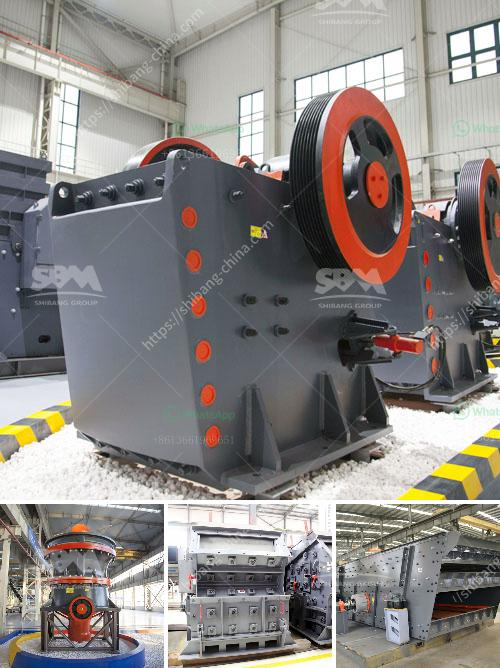

<h3>hp 500 cone crusher parts</h3>
The HP 500 cone crusher is a popular model in the HP series cone crusher family. It is available for both stationary and mobile applications. With more than 200 years of combined crusher experience, the engineers at Metso Outotec have developed a new cone crusher that is specifically designed for heavy-duty applications.

The HP 500 cone crusher provides high versatility and energy efficiency. The dual-acting hydraulic tramp-release cylinders are used to let the crusher pass tramp iron and to provide a large clearing stroke if needed. The double accumulator combination provides better reactivity and load control compared to other designs.

One of the significant advantages of the HP series cone crushers is their capability to produce a fine product with a cubic shape. This is achieved through the use of the innovative crushing principle, which combines the rotating eccentricity with the constant liner performance (CLP) crushing action.

The cone crusher parts for the HP 500 series hold up to the toughest aggregates, quarrying, and mining applications. These parts help to maximize the crusher's productivity and efficiency while reducing maintenance and downtime. Some of the key cone crusher parts include:

1. Mantle and Bowl Liner: The mantle and bowl liner are the key components of the crushing chamber. They provide the necessary crushing action and protect the crusher's mainframe from wear and damage caused by the material being crushed.

2. Eccentric Assembly: The eccentric assembly is responsible for the movement of the main shaft, which in turn drives the mantle and bowl liner. It ensures a consistent and precise crushing action, providing high performance and reliability.

3. Mainframe: The mainframe houses the crusher's main components, including the eccentric assembly, countershaft, and gear. It provides structural support and protection to the crusher, ensuring its long-lasting performance.

4. Crushing Chamber: The crushing chamber is where the rock is crushed between the mantle and bowl liner. The design of the crushing chamber plays a crucial role in determining the crusher's performance and product shape.

5. Tramp Release System: The tramp release system is designed to safely and quickly release any uncrushable material that may be trapped in the crushing chamber. This helps to minimize downtime and protect the crusher from damage.

In conclusion, the HP 500 cone crusher is a versatile and efficient cone crusher that provides high productivity and quality product shape. Its robust construction, advanced design, and advanced wear parts ensure reliable and long-lasting performance. Whether it is used in aggregates, mining, or industrial applications, the HP 500 cone crusher is built to handle the toughest operations. If you are looking for a cone crusher that delivers high performance and low operating costs, the HP 500 cone crusher is worth considering.
<h3>Contact us</h3><ul><li><strong>Whatsapp:&nbsp;<a href="https://wa.me/8613661969651">+8613661969651</a></strong></li><li><a href="https://swt.shibang-china.com/?git&amp;zhl&amp;hp 500 cone crusher parts"><strong>Online Service(chat now)</strong></a></li></ul><h3>Related</h3><ul><li><a href='concrete crusher business proposal.md'>concrete crusher business proposal</a></li><li><a href='ball mill in romania.md'>ball mill in romania</a></li><li><a href='grinding machine for industrial use.md'>grinding machine for industrial use</a></li><li><a href='set up coal pulverizer plant.md'>set up coal pulverizer plant</a></li><li><a href='marble granding machine price in india.md'>marble granding machine price in india</a></li></ul>