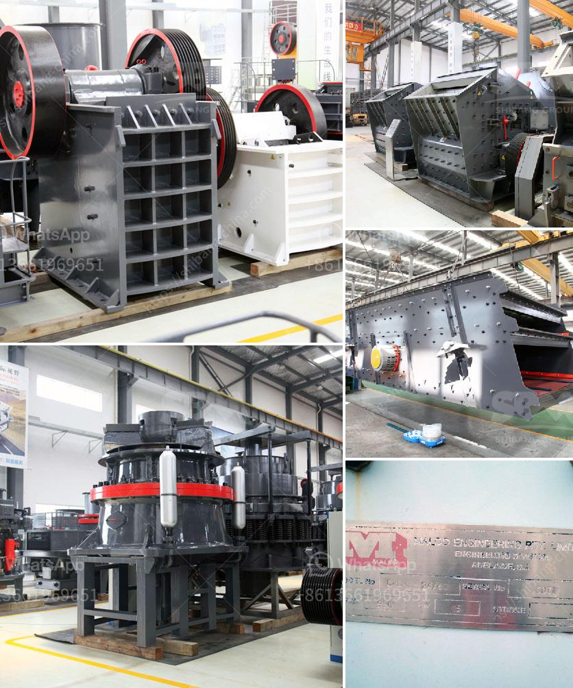

<h3>hydraulic jaw crusher</h3>
The hydraulic jaw crusher is the most well-known, widespread version of crushing equipment and has been widely used in sectors such as mining, metallurgy, building materials, transportation, and many others as well. This jaw crusher is widely used in the crushing of various ores and bulk materials in mining, smelting, building materials, highways, railways, water conservancy, and chemical industries.

The hydraulic jaw crusher is the perfect combination of modern technology and production practice, which is more in line with the majority of customers' requirements about automation production. The hydraulic jaw crusher has been praised by users for its simple structure, wide adaptability, reliable performance, and low operating cost.

One of the key advantages of the hydraulic jaw crusher is its ability to adjust the discharge port, which can regulate the particle size of the finished product. This adjustment ensures that the final product is very fine and well-shaped. Moreover, the hydraulic system can quickly clear the crushing chamber, greatly reducing downtime and improving work efficiency.

In addition to its convenient adjustment of the discharge port, the hydraulic jaw crusher also has a convenient maintenance system. The overall structure is designed to facilitate maintenance, saving both time and effort. This ensures that the machine operates consistently and reliably for long periods.

The hydraulic jaw crusher adopts a fully sealed structure for environmental protection and noise reduction. It uses a unique dustproof sealing structure to effectively control the dissemination of dust and noise. This feature makes it more suitable for working in mines, construction sites, and other environments where dust and noise must be strictly controlled.

In conclusion, the hydraulic jaw crusher has many advantages, including its fully adjustable discharge port, convenient maintenance system, environmentally friendly design, and reliable performance. It has become a popular choice among customers in various industries. With its advanced technology and impeccable crushing capacity, the hydraulic jaw crusher is undoubtedly an excellent investment for users.
<h3>Contact us</h3><ul><li><strong>Whatsapp:&nbsp;<a href="https://wa.me/8613661969651">+8613661969651</a></strong></li><li><a href="https://swt.shibang-china.com/?git&amp;zhl&amp;hydraulic jaw crusher"><strong>Online Service(chat now)</strong></a></li></ul><h3>Related</h3><ul><li><a href='composetion of terracotta tiles.md'>composetion of terracotta tiles</a></li><li><a href='mining hammer mill suppliers.md'>mining hammer mill suppliers</a></li><li><a href='suppliers of chrome ore beneficiation plant.md'>suppliers of chrome ore beneficiation plant</a></li><li><a href='standards sizes of conveyor belts.md'>standards sizes of conveyor belts</a></li><li><a href='small grinding mill machine in india.md'>small grinding mill machine in india</a></li></ul>