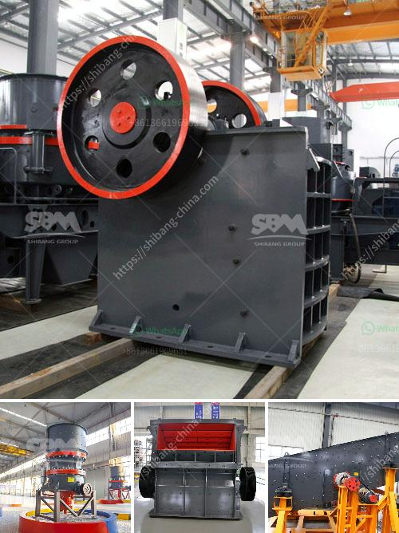

<h3>impact crusher design</h3>
The mining and construction industries have always been a vital part of the global economy. With the continuous advancements in technology, these industries have seen steady growth and development. One such technological advancement is the design of efficient and robust impact crushers.

Impact crushers are machines that are used to crush materials of varying hardness and sizes. The crushing mechanism employed in these machines is called impact crushing. With impact crushing, material is introduced into a chamber containing a high-speed rotor with hammers or blow bars that collide with the incoming feed material and break it apart. The resulting fragments are then thrown against impact plates, where they are further crushed and then directed out of the crusher through openings in the impact plates.

The design of impact crushers has evolved rapidly over the years, with the aim of achieving better crushing efficiency and durability. Older designs tend to be bulky, heavy, and complex, which impacts the overall performance and maintenance of the machine. However, modern impact crusher designs have overcome these limitations and are capable of delivering superior performance and reliability.

One significant design improvement in modern impact crushers is the use of a hydraulic system to adjust the impact aprons and the rotor. This allows operators to control the gap between the impact aprons and the rotor, enabling them to fine-tune the desired size of the output material. The hydraulic system also helps in preventing damage to the crusher in case of an overload by automatically releasing the material and resetting the machine.

Another critical aspect of impact crusher design is the rotor. The rotor plays a vital role in the overall performance of the crusher. It is responsible for imparting the necessary kinetic energy to the incoming feed material. Modern impact crusher rotors are often designed with a high inertia mass to ensure efficient crushing and reduce power consumption. Additionally, the rotor's shape and number of blow bars or hammers are optimized to deliver maximum impact force, resulting in higher crushing efficiency.

Furthermore, advancements in metallurgy have significantly enhanced the durability and wear resistance of impact crusher parts. The use of high-strength alloys and advanced manufacturing techniques allows for the production of impact crusher components that can withstand the rigors of continuous operation in harsh mining and construction environments. This, in turn, reduces downtime and maintenance costs, leading to improved productivity.

Apart from the design improvements, impact crushers have also undergone technological advancements that enable efficient and precise control over the crushing process. Automation systems equipped with sensors and programmable logic controllers (PLCs) monitor the crusher's operating parameters and adjust the settings accordingly. This ensures optimal performance, enhances safety, and protects the crusher from potential damages caused by abnormal operating conditions.

In conclusion, the design of impact crushers has experienced significant advancements in recent years, resulting in machines that are more efficient, durable, and reliable. These improvements have enabled the mining and construction industries to achieve higher productivity levels while minimizing downtime and maintenance costs. As technology continues to evolve, it is expected that impact crushers will witness further innovations, further revolutionizing the crushing industry.
<h3>Contact us</h3><ul><li><strong>Whatsapp:&nbsp;<a href="https://wa.me/8613661969651">+8613661969651</a></strong></li><li><a href="https://swt.shibang-china.com/?git&amp;zhl&amp;impact crusher design"><strong>Online Service(chat now)</strong></a></li></ul><h3>Related</h3><ul><li><a href='hammer crusher micron size product.md'>hammer crusher micron size product</a></li><li><a href='mobile crushers qatar.md'>mobile crushers qatar</a></li><li><a href='cement clinker grinding plant in india.md'>cement clinker grinding plant in india</a></li><li><a href='coal charcoal crushing grinding machine small.md'>coal charcoal crushing grinding machine small</a></li><li><a href='concrete crushing plant in dubai.md'>concrete crushing plant in dubai</a></li></ul>