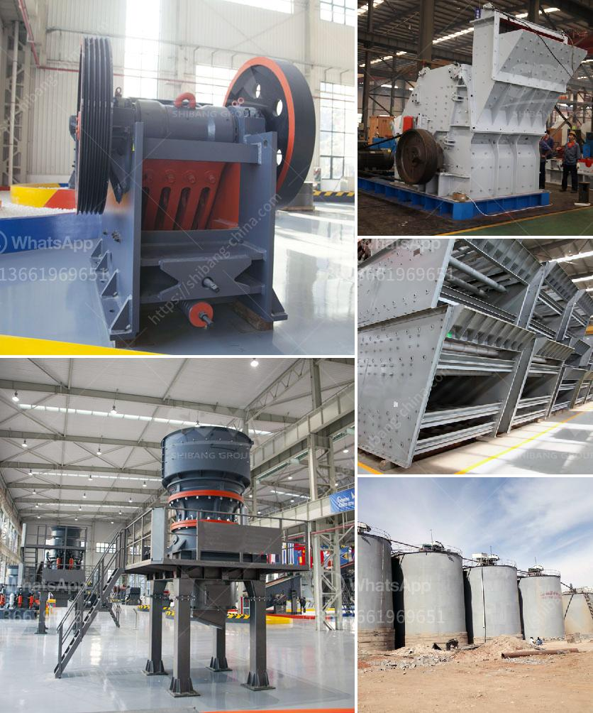

<h3>impact crusher for iron ore</h3>
Iron ore is one of the most important raw materials for steel production enterprises, and its quality has a direct impact on the efficiency of downstream processes. An important task in the mining industry is to improve the grade of iron ore and use it more efficiently. The development of efficient and highly automated impact crushers for iron ore production can significantly enhance the efficiency of iron ore production lines. In this article, we will discuss the reasons to choose Shanghai Shibang Machinery Company, a professional mining machinery manufacturer, as your partner for iron ore impact crusher solutions.

One of the main advantages of choosing an impact crusher is its ability to break down large pieces of material into manageable sizes. This is especially important for iron ore, which can vary in size from large chunks to fine powders. The impact crusher uses the principle of impact and friction to reduce the material size. It utilizes a rotor with high-speed rotation that impacts the material and breaks it into smaller pieces. The iron ore is then further crushed by the impact plates and discharged from the discharge port.

Shanghai Shibang Machinery Company has designed and produced various types of impact crushers suitable for iron ore crushing, such as PF series, PFW series, and CI5X series. The impact crusher for iron ore produced by Shanghai Shibang Machinery Company has outstanding performance and advantages. It is the most suitable crushing machine for iron ore crushing.

Impact crushers have unique advantages compared to other crushers. Firstly, the impact crusher has a high crushing ratio, which can reach over 50. This greatly reduces the number of crushing stages and saves production costs. Secondly, the impact crusher has a large crushing cavity, which can process a large amount of material at one time. This increases the production capacity and improves the overall efficiency. Thirdly, the impact crusher has adjustable discharge size, allowing users to control the final product size according to their needs. This makes it suitable for various applications in the mining industry.

In addition, Shanghai Shibang Machinery Company has advanced technology and equipment for iron ore impact crusher production. The company has a strong R&D team and adopts advanced manufacturing processes to ensure the quality and durability of its products. The impact crusher for iron ore produced by Shanghai Shibang Machinery Company has a long service life and can operate continuously for a long time. Moreover, the company provides excellent after-sales service, offering technical support and maintenance for its products.

To sum up, choosing an impact crusher for iron ore production has many advantages. It can enhance the efficiency of iron ore production lines, reduce production costs, and improve the quality of iron ore. Shanghai Shibang Machinery Company is a professional mining machinery manufacturer, with advanced technology and equipment. Their impact crushers for iron ore have excellent performance and durability. Choosing Shanghai Shibang Machinery Company as your partner can help you achieve higher efficiency and profitability in iron ore production.
<h3>Contact us</h3><ul><li><strong>Whatsapp:&nbsp;<a href="https://wa.me/8613661969651">+8613661969651</a></strong></li><li><a href="https://swt.shibang-china.com/?git&amp;zhl&amp;impact crusher for iron ore"><strong>Online Service(chat now)</strong></a></li></ul><h3>Related</h3><ul><li><a href='vsi crusher plants in uae.md'>vsi crusher plants in uae</a></li><li><a href='cost of complete stone crushing plant in ghana.md'>cost of complete stone crushing plant in ghana</a></li><li><a href='conventional hammer mill.md'>conventional hammer mill</a></li><li><a href='quartz powder manufacturers manufacturers in china.md'>quartz powder manufacturers manufacturers in china</a></li><li><a href='cement grinding station quotations.md'>cement grinding station quotations</a></li></ul>