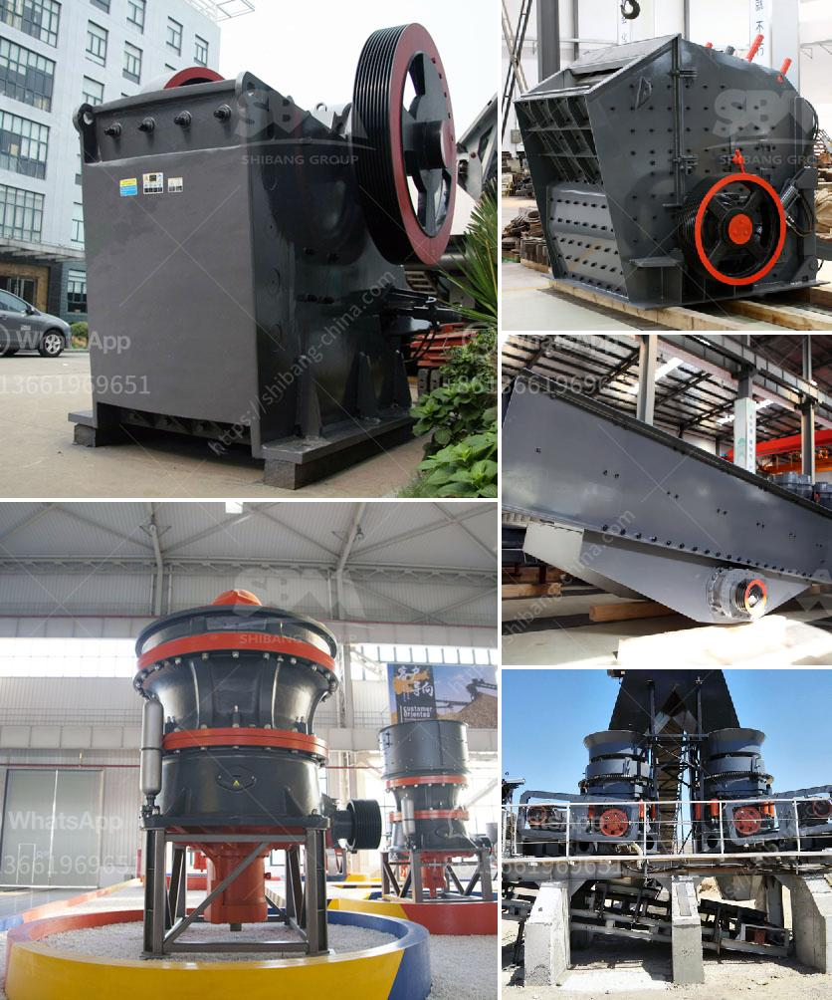

<h3>impact crusher manufacturers in germany</h3>
Germany is a developed country with rich industrial production, and the mining machinery industry has played an important role in its development. Impact crusher is widely used in the fields of metallurgy, mining, cement, construction, refractory materials, ceramics, chemical industry, highways and railways. In recent years, the German mining machinery industry has achieved impressive results, and the impact crusher manufacturers in Germany such as Kleemann, Metso, and SBM have made outstanding contributions to the German mining industry.

In Germany, the impact crusher market is fierce. With more than 100 manufacturers competing, the market is large and the pressure is high. Manufacturers of impact crushers in Germany understand that refining is necessary to maintain the competitiveness of the product in the market. In the refining process, the equipment produced by the impact crusher manufacturer is dominant. In the fierce competition, the impact crusher manufacturer has always been a leader.

Because the equipment has a long service life, it is not easily damaged. Large crushing ratio, low energy consumption, low noise, high output, light weight, easy installation and maintenance, easy operation and other characteristics, so it is favored by many industries. The impact crusher market is not only very large, but also very wide. According to the different application scope, the impact crusher can be divided into many kinds, but there are only a few manufacturers that can really produce high efficiency, high quality impact crushers.

In Germany, there are many impact crusher manufacturers, among which SBM is a well-known one. SBM has always been committed to the production and development of various mining equipment, such as sand making machine, crusher, mobile crushing station, etc. Recently, SBM has focused on the production of high-efficiency and environmentally-friendly impact crushers, specifically for the field of construction waste recycling, which has won widespread praise.

Kleemann, another Germany-based company, specializes in the production of mobile crushers and screening plants. With innovative products and high-quality service, Kleemann continues to create new opportunities for customers in the field of construction waste recycling. The company has always adhered to the principle of customer-oriented, providing customers with the most comprehensive and advanced equipment solutions.

Metso is another well-known Germany-based impact crusher manufacturer. Metso's focus is on providing customers with cost-effective and environmentally-friendly solutions, with advanced technology and excellent quality. Metso has extensive experience in the production of impact crushers, with many successful cases in different countries around the world.

In conclusion, the impact crusher manufacturers in Germany have observed that the refining process is essential to maintain the competitiveness of the product in the market. In the refining process, the equipment produced by the impact crusher manufacturers is dominant. As a developed country, Germany's mining machinery industry is also fully mature. The impact crusher manufacturers in Germany are committed to the continuous improvement and innovation of equipment. Therefore, each company offers high-quality impact crushers to customers.
<h3>Contact us</h3><ul><li><strong>Whatsapp:&nbsp;<a href="https://wa.me/8613661969651">+8613661969651</a></strong></li><li><a href="https://swt.shibang-china.com/?git&amp;zhl&amp;impact crusher manufacturers in germany"><strong>Online Service(chat now)</strong></a></li></ul><h3>Related</h3><ul><li><a href='sand crusher for sale.md'>sand crusher for sale</a></li><li><a href='stone crushing machine manufacturer.md'>stone crushing machine manufacturer</a></li><li><a href='gravel wash plant for sale.md'>gravel wash plant for sale</a></li><li><a href='gravel crushing plant.md'>gravel crushing plant</a></li><li><a href='feldspar stone crusher.md'>feldspar stone crusher</a></li></ul>