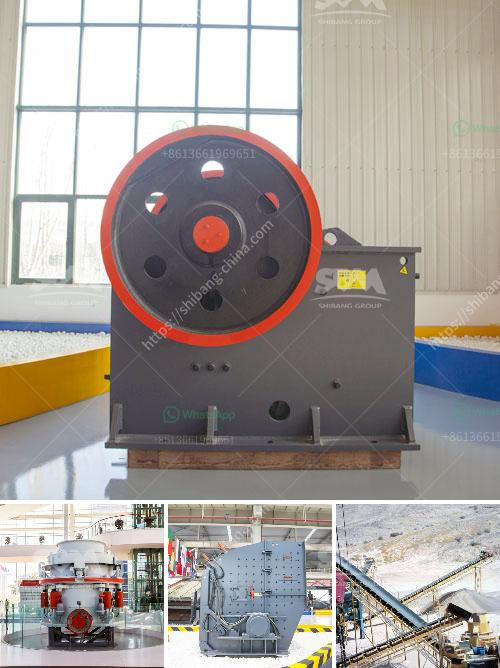

<h3>impact crusher sale</h3>
Impact crushers are widely used in mining, construction, and quarrying industry to crush and shape rock or other materials into desired size and standard. With its high efficiency and reliable performance, it has become the preferred choice for crushing machines.

One of the key components of an impact crusher is the rotor. Rotor plays an important role in the overall performance of the crusher. It consists of a main shaft, a disc, a spindle, and a hammer. The rotor spins at high speed driven by the motor, and the materials are fed into the crushing chamber through the feed inlet. The high-speed impact of the hammer on the materials causes them to be crushed and thrown against the impact plates, which further breaks them into smaller pieces.

The impact crusher sale offers several advantages over other crushing machines. First, it has a simplified crushing process. It reduces the raw materials to the desired size through a single impact, eliminating the need for multiple stages of crushing. This not only saves time but also reduces energy consumption.

Second, the impact crusher can produce a uniform and cubical-shaped end product. The impact plates in the crushing chamber are adjustable, allowing the operator to control the size and shape of the final product. This makes it ideal for producing aggregates for construction and road projects.

Third, the impact crusher is highly efficient in crushing hard and abrasive materials. Due to its high-speed rotational motion, it can break rocks and minerals with high compressive strength. This makes it suitable for crushing materials such as limestone, granite, and basalt, which are commonly found in mining and quarrying operations.

Another advantage of an impact crusher sale is its low maintenance requirements. With its simple design and fewer moving parts, it is easier to maintain and repair compared to other crushing machines. This reduces downtime and increases the overall productivity of the crushing operation.

Furthermore, impact crushers come in various sizes and capacities to meet different production requirements. Whether it is a small-scale project or a large-scale operation, there is an impact crusher available to suit the specific needs of the customer. Some manufacturers even offer customized solutions to meet unique crushing requirements.

In conclusion, the impact crusher sale is a reliable and efficient crushing machine that offers numerous advantages. With its simplified crushing process, ability to produce uniform and cubical-shaped end products, and low maintenance requirements, it has become an essential tool in the mining, construction, and quarrying industry. Whether for small-scale projects or large-scale operations, the impact crusher is a valuable asset that can greatly improve the productivity and profitability of any crushing operation.
<h3>Contact us</h3><ul><li><strong>Whatsapp:&nbsp;<a href="https://wa.me/8613661969651">+8613661969651</a></strong></li><li><a href="https://swt.shibang-china.com/?git&amp;zhl&amp;impact crusher sale"><strong>Online Service(chat now)</strong></a></li></ul><h3>Related</h3><ul><li><a href='quarry equipment prices.md'>quarry equipment prices</a></li><li><a href='gold mining machine indonesia equipment nigeria.md'>gold mining machine indonesia equipment nigeria</a></li><li><a href='granite stone crusher india.md'>granite stone crusher india</a></li><li><a href='ball mills for mining.md'>ball mills for mining</a></li><li><a href='raymond grinding mill in pakistan.md'>raymond grinding mill in pakistan</a></li></ul>