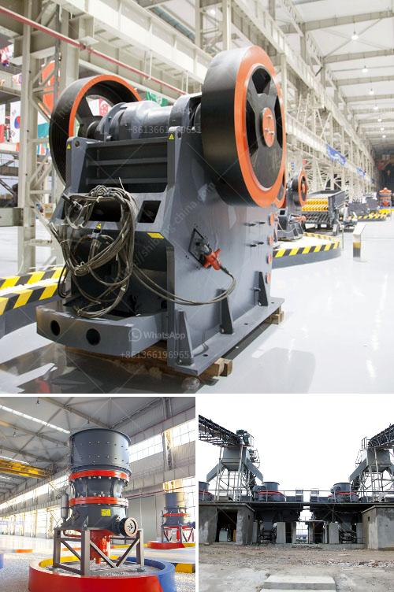

<h3>impact crusher suppliers</h3>
Impact crushers are widely used in various industries for crushing a wide range of materials such as limestone, calcite, dolomite, perlite, etc. They are categorised as primary, secondary, and tertiary crushers based on their functions. Impact crushers are predominantly used in the production of construction aggregates, railway ballast, and road paving stones.

Impact crusher suppliers can provide high quality machines to meet the various demands of customers. As a supplier with many years of manufacturing experience, AIMIX suggests that the impact crusher for sale should be equipped with an impact crusher rotor, which has large rotational inertia and high chromium plate hammer, resulting in high durability, high impact resistance, and high wear resistance. The impact crusher rotor is a crucial component in the machine and plays a vital role in the performance of the equipment. The machine has a unique structure, which helps it wear less, energy consumption and maintenance are also very low. It has a high crushing ratio, combined with the advantages of impact resistance and wear resistance, making it widely used in various industries.

Impact crusher suppliers can provide various types of impact crushers according to customer requirements and actual conditions. The common types include horizontal shaft impact crushers and vertical shaft impact crushers.

While selecting an ideal impact crusher for your business, it is crucial to consider various factors, including the desired productivity, desired finished product shape, project size, and budget. These factors will help you choose the most suitable impact crusher that meets your specific requirements.

A reliable impact crusher supplier can provide customers with the best quality products and services. Therefore, when choosing an impact crusher supplier, customers must consider reliability, reputation, and after-sales service of the supplier to ensure the long-term stable operation of their equipment.

AIMIX Group, a leading impact crusher supplier, has over 30 years of experience. We have focused on providing high-quality mining equipment and professional solutions for customers in the mining, construction, petrochemical, and other industries. We have a complete after-sales service system to provide customers with comprehensive technical support and quick response to any issue that may arise during equipment operation.

At AIMIX, we strive to provide customers with the most cost-effective and efficient crushing solutions. Our impact crushers are designed to reduce large rocks into smaller rocks, gravel, or rock dust. The machines are equipped with advanced technology and reliable components, which ensure high performance and durability. Additionally, we offer customized solutions based on specific requirements and project needs, allowing customers to achieve the desired production goals efficiently.

Impact crusher suppliers, like AIMIX, believe in providing the best value for money to their customers. Our machines are competitively priced without compromising on quality. We understand the importance of delivering the right equipment at the right price, and our goal is to build long-term partnerships with our customers.

In conclusion, impact crusher suppliers play a crucial role in providing reliable and efficient crushing solutions to various industries. The impact crusher machines offered by suppliers should be durable and high-performing to ensure long-lasting operation. By choosing a reliable supplier with a good reputation and exceptional after-sales service, customers can make the right investment that will boost their productivity and profitability. AIMIX Group is committed to providing the best impact crusher solutions and services to meet customers' diverse needs and exceed their expectations.
<h3>Contact us</h3><ul><li><strong>Whatsapp:&nbsp;<a href="https://wa.me/8613661969651">+8613661969651</a></strong></li><li><a href="https://swt.shibang-china.com/?git&amp;zhl&amp;impact crusher suppliers"><strong>Online Service(chat now)</strong></a></li></ul><h3>Related</h3><ul><li><a href='types of diaphragm in ball mill.md'>types of diaphragm in ball mill</a></li><li><a href='gold ore crushers for sale in india.md'>gold ore crushers for sale in india</a></li><li><a href='dolomite stone crusher manufacturers.md'>dolomite stone crusher manufacturers</a></li><li><a href='advantages and disadvantages of ball mill grinding.md'>advantages and disadvantages of ball mill grinding</a></li><li><a href='ultrafine grinding mill.md'>ultrafine grinding mill</a></li></ul>