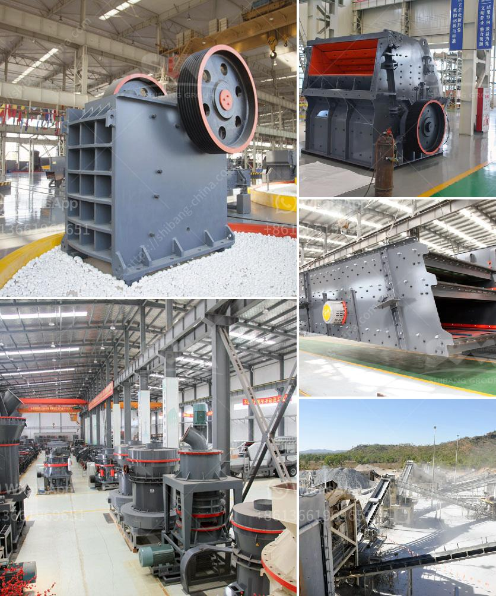

<h3>impact crusher working principle</h3>
The usage of impact crusher is extremely wide. It is not only helpful in the mining and construction industries, but also widely used in chemical, metallurgical, building materials, electric power, transportation, and other industrial sectors. As the newly-designed impact crusher, the working principle of more efficient and power-saving has been further developed in recent years.

The impact crusher works by crushing materials on impact. Once the materials enter the crushing chamber they are crashed against by the impact of the high-speed rotating rotor and then thrown onto the impact plate for a secondary crushing. The rebounded materials will collide with each other in the crushing chamber and be further crushed until the desired size is achieved.

One of the outstanding features of impact crusher is its convenient maintenance and operation. The opening of the impact plate can be adjusted by adjusting the bolt at the back of the impact plate. In addition, the gap between the impact plate and the hammer can be adjusted to control the size of the discharged materials. This flexible adjustment greatly enhances the adaptability of the impact crusher to different material requirements.

Another important working principle of impact crusher is its autogenous working feature. The materials thrown out by the rotor collide with each other in the crushing chamber, forming a vortex motion of materials. This not only increases the efficiency of crushing, but also saves energy by reducing the wear on the hammer and the lining plate.

In conclusion, the impact crusher is a promising machine in the mining and construction industry. Its working principle is as follows: the rotor revolves at high speed in the rotor cavity and is crushed by the impacting plate and hammerhead to achieve the desired final product size. Thanks to its efficient and energy-saving characteristics, impact crusher has been widely applied in the market and gradually becomes more acceptable by customers.
<h3>Contact us</h3><ul><li><strong>Whatsapp:&nbsp;<a href="https://wa.me/8613661969651">+8613661969651</a></strong></li><li><a href="https://swt.shibang-china.com/?git&amp;zhl&amp;impact crusher working principle"><strong>Online Service(chat now)</strong></a></li></ul><h3>Related</h3><ul><li><a href='equipment used in small scale mining in ghana.md'>equipment used in small scale mining in ghana</a></li><li><a href='graphite beneficiation plant at nigeria.md'>graphite beneficiation plant at nigeria</a></li><li><a href='stone crusher price in ethiopia.md'>stone crusher price in ethiopia</a></li><li><a href='harga dan tipe stone crusher indonesia.md'>harga dan tipe stone crusher indonesia</a></li><li><a href='small gold wash plant for sale in canada.md'>small gold wash plant for sale in canada</a></li></ul>