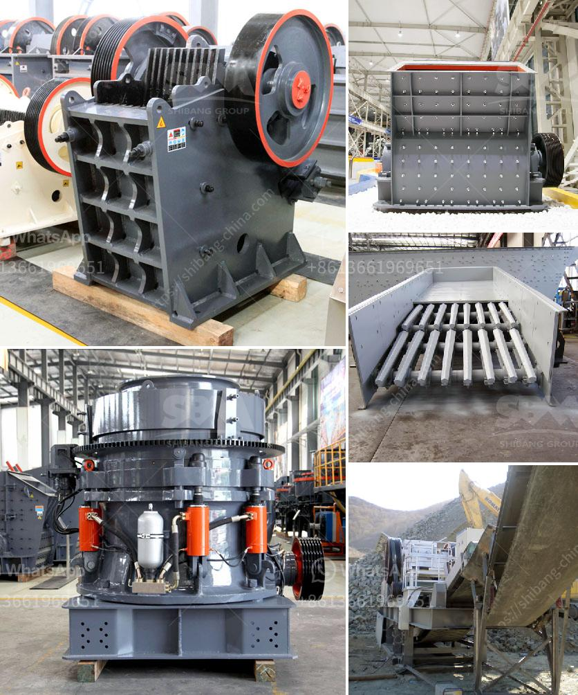

<h3>impact crushing machine price</h3>
The impact crushing machine has become an essential equipment in many industries due to its ability to reduce large rocks into smaller particles. This machine is widely used in mining, construction, and recycling applications, among others. However, one crucial factor that influences its popularity is its price. In this article, we will discuss the factors that affect impact crushing machine prices.

The size and capacity of the impact crushing machine play a significant role in determining its price. Generally, larger machines are priced higher because of the increased materials and labor required for construction. Moreover, machines with higher capacity tend to be more expensive due to their ability to process larger volumes of material. Manufacturers typically offer various models and sizes of impact crushers, allowing customers to choose one that suits their specific needs and budget.

When it comes to machinery, quality and durability are essential factors that determine not only the price but also the long-term value of the investment. Impact crushers with a robust and durable construction tend to have a higher price tag. These machines are built to withstand heavy-duty applications and offer a longer service life, resulting in lower maintenance costs and improved operational efficiency. Investing in a high-quality impact crushing machine may initially seem expensive, but it can save money in the long run.

Advancements in technology often translate into higher prices for impact crushing machines. Newer models may come with additional features, such as automation, remote monitoring, and advanced controls, which enhance the machine's performance and ease of operation. These modern features can contribute to a higher price, but they also offer improved productivity and reduced downtime, making them a worthwhile investment for many customers.

The reputation of the manufacturer also influences the pricing of impact crushing machines. Well-established brands with a history of delivering reliable and efficient machinery tend to charge premium prices for their products. The high price reflects the trust and confidence that customers have in the brand. On the other hand, lesser-known or new entrants in the market may offer lower-priced machines to attract customers and establish their presence in the industry. However, customers must weigh the potential risks associated with choosing a less reputable brand against the cost savings.

Market conditions, such as demand and competition, can significantly impact the prices of impact crushing machines. When the demand for these machines is high, and the supply is limited, manufacturers may increase their prices to maximize profitability. Conversely, in a highly competitive market where several manufacturers offer similar products, price competition may drive down the prices. It is essential for customers to stay informed about market dynamics and compare prices from different manufacturers to make an informed purchasing decision.

In conclusion, the price of an impact crushing machine is influenced by various factors, including machine size and capacity, quality and durability, technology and features, brand reputation, and market conditions. Customers must carefully evaluate these factors based on their specific requirements and budget to choose a machine that offers the best value for their investment.
<h3>Contact us</h3><ul><li><strong>Whatsapp:&nbsp;<a href="https://wa.me/8613661969651">+8613661969651</a></strong></li><li><a href="https://swt.shibang-china.com/?git&amp;zhl&amp;impact crushing machine price"><strong>Online Service(chat now)</strong></a></li></ul><h3>Related</h3><ul><li><a href='types of coal crusher used in industry.md'>types of coal crusher used in industry</a></li><li><a href='cement plant for sale.md'>cement plant for sale</a></li><li><a href='200 mesh ore grinder cost.md'>200 mesh ore grinder cost</a></li><li><a href='small scale gold ball mill.md'>small scale gold ball mill</a></li><li><a href='portable crushing machine from spain.md'>portable crushing machine from spain</a></li></ul>