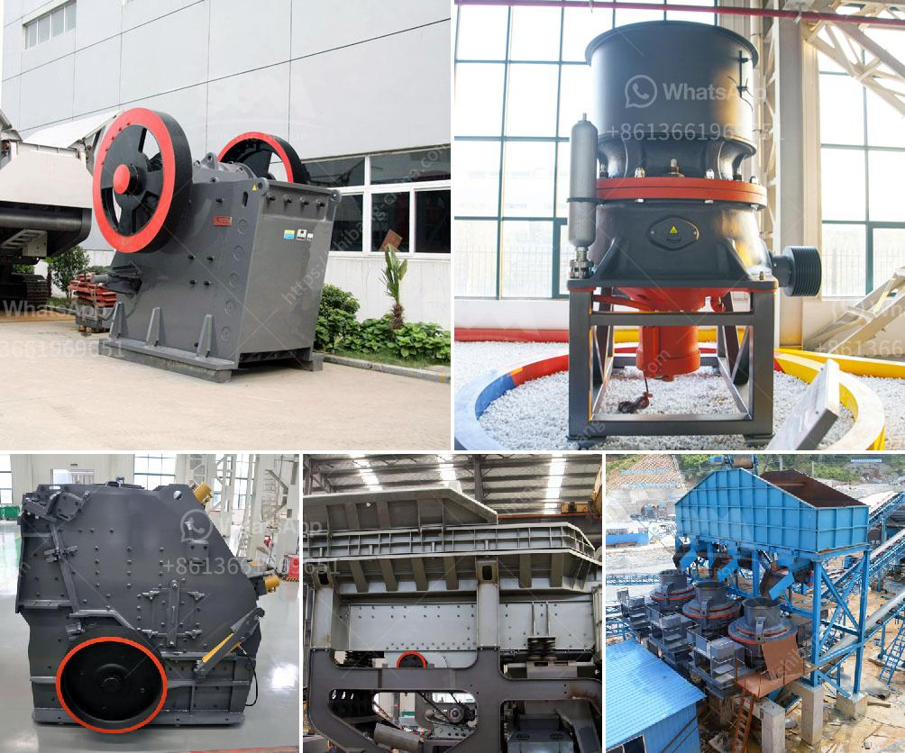

<h3>india gold processing plant apr</h3>
India is a country known for its rich history and culture, as well as its abundance of natural resources. Among these resources, gold has played a significant role in the country's economy and society for centuries. With the demand for gold showing no signs of slowing down, India has invested in establishing gold processing plants to meet the growing needs of its population.

One such gold processing plant in India is the APR (Advanced Processing and Refining) plant. Equipped with state-of-the-art technology, this plant is capable of refining gold to the highest quality standards. It employs a team of skilled professionals who ensure that the entire process is carried out efficiently and accurately.

The gold processing plant follows a series of steps to extract pure gold from its ore. Firstly, the ore is crushed and ground to a fine powder. It is then mixed with water to form a slurry. This slurry is treated with chemicals to separate gold particles from other minerals. Sodium cyanide is often used in this process, as it helps dissolve gold.

Once the gold particles are separated, they undergo further treatment to remove impurities. This involves the use of acids and other chemicals to purify the gold and achieve the desired level of purity. Finally, the refined gold is cast into bars or other desired shapes.

India's gold processing plants, like the APR plant, contribute significantly to the country's economy by providing employment opportunities and boosting the gold industry. Moreover, these plants ensure that the gold produced meets international quality standards, making it highly sought after in global markets.

In conclusion, India's gold processing plants, such as the APR plant, serve a crucial role in catering to the increasing demand for gold. With their advanced technology and skilled workforce, these plants contribute to the country's economy while ensuring the production of high-quality gold. As the demand for gold continues to rise, India's gold processing plants will play a vital role in meeting this demand and maintaining India's position as a prominent player in the global gold industry.
<h3>Contact us</h3><ul><li><strong>Whatsapp:&nbsp;<a href="https://wa.me/8613661969651">+8613661969651</a></strong></li><li><a href="https://swt.shibang-china.com/?git&amp;zhl&amp;india gold processing plant apr"><strong>Online Service(chat now)</strong></a></li></ul><h3>Related</h3><ul><li><a href='graphite manufacturing plant.md'>graphite manufacturing plant</a></li><li><a href='small impact crusher.md'>small impact crusher</a></li><li><a href='pulverizing machines in south africa.md'>pulverizing machines in south africa</a></li><li><a href='granite crusher factory.md'>granite crusher factory</a></li><li><a href='limestone grinding roller mill.md'>limestone grinding roller mill</a></li></ul>