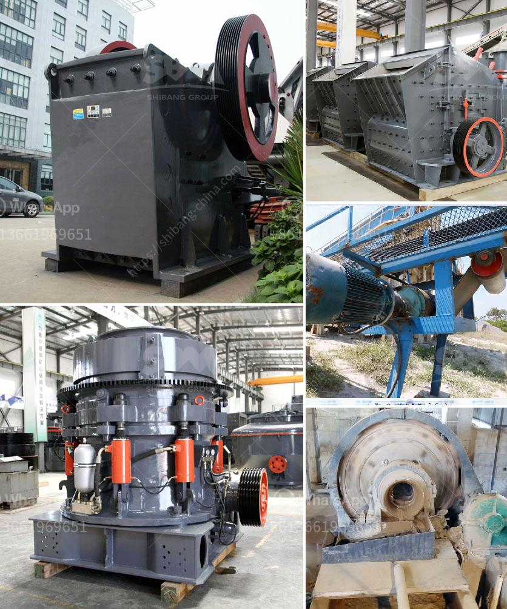

<h3>india grinding machine for talcum powder</h3>
India is known for its rich cultural heritage, diverse traditions, and a booming industrial sector. One such thriving industry is the manufacturing of grinding machines for talcum powder. Talcum powder is a mineral-based product that is extensively used in various industries like cosmetics, ceramics, paints, and more.

The grinding machine for talcum powder is designed to produce superfine powder or micro powder of different materials with hardness below 6 in Moh's scale and humidity below 6 percent such as kaolin, limestone, calcite, marble, talcum, barite, gypsum, dolomite, bentonite mud, mica, pyrophyllite, sepiolite, diatomite, graphite, alunite, fluorite, potassium feldspar, phosphorite, pigment, and so on. The granularity of the final products can be adjusted freely from 80 mesh to 3000 mesh.

In India, grinding machines have wide application to process locally available mineral ores. The domestic grinding machine for talcum powder processing has witnessed various modifications and improvements, which include high-speed impellers and classifiers to exponentially improve powder fineness, manufacturing capacity, and energy efficiency.

Talcum powder processing starts with the crushing of talc ore, generally in a jaw crusher, and then the talc is sent to a Raymond mill for grinding. After grinding, the fine talc powder is sent to a cyclone collector and then a pulse dust collector. After filtration and dust collection, the finished product is transported to the product warehouse or sent directly to the market.

India has rich reserves of talc minerals, making it an ideal location for talcum powder grinding machine manufacturers. With advanced technology, diversified product portfolio, and efficient after-sales services, these manufacturers have gained a competitive edge in the global market. They cater to both domestic and international clients, providing customized solutions and high-quality products.

Furthermore, the grinding machine for talcum powder production line is equipped with professional dust removal devices to ensure a pollution-free and eco-friendly working environment. The advanced electric control system ensures convenient and stable operation, helping manufacturers reduce labor costs and improve overall production efficiency.

In conclusion, the grinding machine for talcum powder production in India offers superior performance, making it suitable for diverse applications. The machine saves energy and provides great value for money. If you are in need of any grinding machine, whether for talcum powder or any other mineral-based products, India is the place to be.
<h3>Contact us</h3><ul><li><strong>Whatsapp:&nbsp;<a href="https://wa.me/8613661969651">+8613661969651</a></strong></li><li><a href="https://swt.shibang-china.com/?git&amp;zhl&amp;india grinding machine for talcum powder"><strong>Online Service(chat now)</strong></a></li></ul><h3>Related</h3><ul><li><a href='andhra pradesh coal crusher equipment price.md'>andhra pradesh coal crusher equipment price</a></li><li><a href='puzzolana crushers coimbatore.md'>puzzolana crushers coimbatore</a></li><li><a href='used crushers in america.md'>used crushers in america</a></li><li><a href='crusher machine on lease in hyderabad.md'>crusher machine on lease in hyderabad</a></li><li><a href='conveyor belt manufacturers bangladesh.md'>conveyor belt manufacturers bangladesh</a></li></ul>