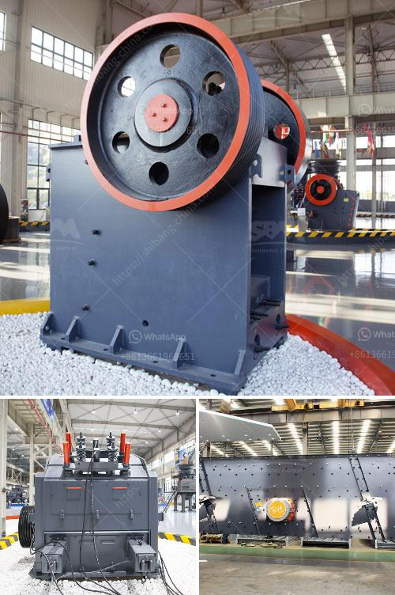

<h3>indonesia ball mill</h3>
Indonesia is known for its abundant natural resources and diverse mineral deposits. With over 2,300 mines and lucrative extraction sites, the country is a leading global exporter of minerals such as coal, nickel, tin, copper, and gold. This extensive mining industry demands reliable machinery to efficiently process and grind materials. Among the essential pieces of equipment in this sector is the ball mill, a versatile and cost-effective grinding solution.

Ball mills, also known as rotary mills, are widely used in industrial applications due to their high grinding efficiency and versatility. These mills are designed to grind materials by cascading them inside a rotating cylinder, causing impact and attrition. The material to be ground is fed into the cylinder, thereby becoming subject to repeated collisions with the grinding media (balls or beads) inside.

In the mining sector, the ball mill performs the vital role of transforming raw materials into finely ground particles, which are then used for further processing. From copper to gold mines, ball mills are used in a variety of industries due to their ability to crush materials of varying sizes, making them optimal for breaking down large chunks of rock into smaller, more manageable sizes.

There are several advantages to using ball mills for mining applications. For starters, ball mills are stronger and more robust than alternative solutions, such as crushers. A typical ball mill features a cylindrical shell that rotates around its own axis. This rotation generates strong centrifugal forces, causing the grinding media inside the mill to experience high acceleration. These forces efficiently grind the material, resulting in improved particle size distribution and reduced energy consumption.

Additionally, ball mills are versatile machines capable of grinding materials of different hardness levels. They can be used for both wet and dry grinding, making them suitable for a wide range of applications. Furthermore, ball mills require minimal maintenance, ensuring reliable operation with minimal downtime.

Indonesia's large mining sector plays a crucial role in the nation's economy, contributing significantly to the GDP growth rate. As the demand for minerals and resources continues to rise, the country must ensure that it can effectively process these materials. Ball mills are an integral part of this process.

With the growth of Indonesia's mining industry, the ball mill market is expanding, presenting opportunities for both domestic and international manufacturers. As competition intensifies, technological advancements strive to enhance product performance, offering businesses a competitive edge.

The ball mill industry in Indonesia is growing at a rapid pace and offers some excellent investment opportunities. With a deepening global interest in the mining industry, significant improvements have been made to increase the efficiency and safety of this equipment. This, along with ongoing government support for the advancement of mining and mineral processing, will ensure a thriving ball mill industry for years to come in Indonesia.
<h3>Contact us</h3><ul><li><strong>Whatsapp:&nbsp;<a href="https://wa.me/8613661969651">+8613661969651</a></strong></li><li><a href="https://swt.shibang-china.com/?git&amp;zhl&amp;indonesia ball mill"><strong>Online Service(chat now)</strong></a></li></ul><h3>Related</h3><ul><li><a href='graphite mining india.md'>graphite mining india</a></li><li><a href='cone crusher in china cone.md'>cone crusher in china cone</a></li><li><a href='sand washing machine lsx920.md'>sand washing machine lsx920</a></li><li><a href='stone gravel crusher price at ranchi.md'>stone gravel crusher price at ranchi</a></li><li><a href='feldspar grinding mill.md'>feldspar grinding mill</a></li></ul>